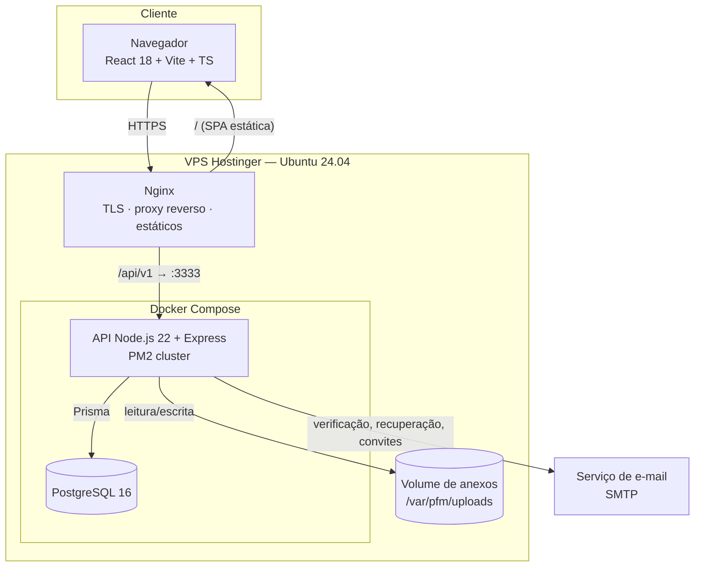
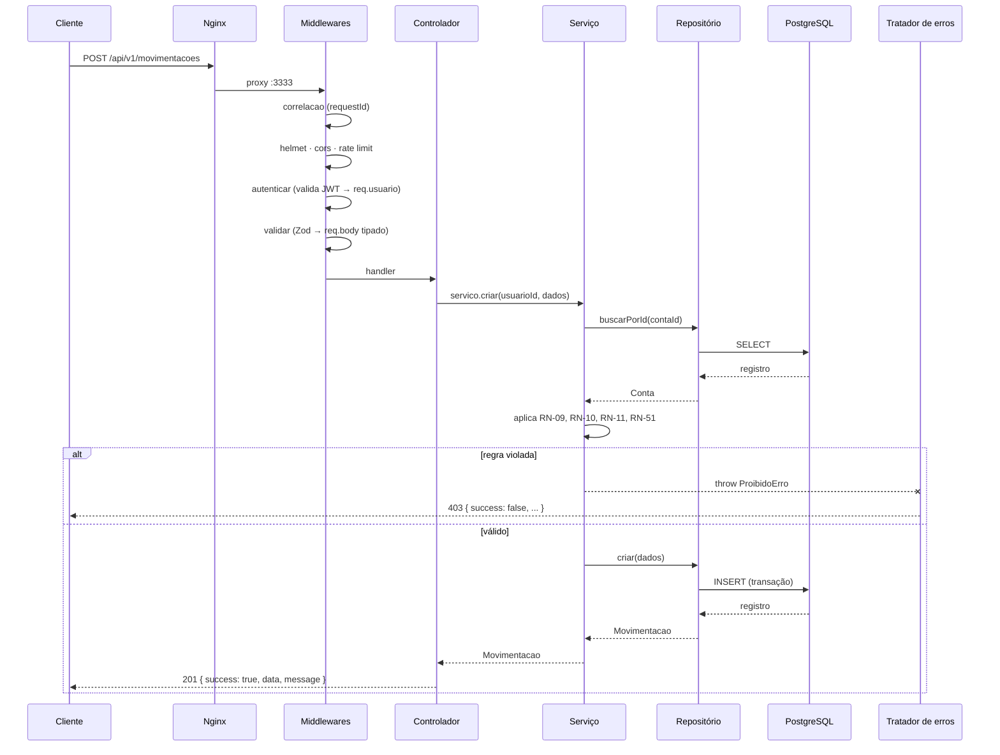
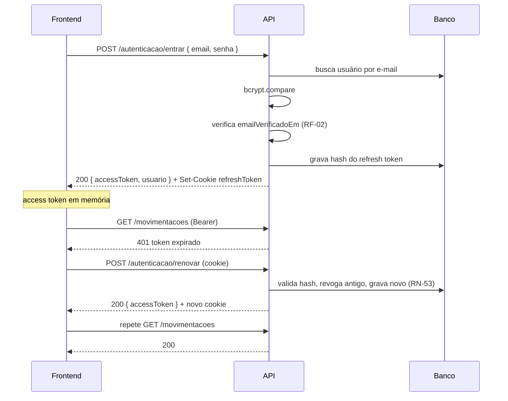

# 02 — Arquitetura

> **Documento:** Arquitetura de Software
> **Projeto:** Gerenciador de Finanças (PFM)
> **Versão:** 1.0.0 · **Data:** 2026-07-29 · **Status:** Vigente

---

## Sumário

1. [Visão geral](#1-visão-geral)
2. [Arquitetura do backend](#2-arquitetura-do-backend)
3. [Estrutura de pastas do backend](#3-estrutura-de-pastas-do-backend)
4. [Ciclo de vida de uma requisição](#4-ciclo-de-vida-de-uma-requisição)
5. [Tratamento de erros](#5-tratamento-de-erros)
6. [Arquitetura do frontend](#6-arquitetura-do-frontend)
7. [Estrutura de pastas do frontend](#7-estrutura-de-pastas-do-frontend)
8. [Autenticação e autorização](#8-autenticação-e-autorização)
9. [Tarefas agendadas](#9-tarefas-agendadas)
10. [Arquivos e anexos](#10-arquivos-e-anexos)
11. [Observabilidade](#11-observabilidade)
12. [Topologia de produção](#12-topologia-de-produção)
13. [Decisões arquiteturais (ADRs)](#13-decisões-arquiteturais-adrs)

---

## 1. Visão geral

O PFM é uma aplicação web em duas partes independentes, publicadas no mesmo domínio e comunicando-se exclusivamente por API REST sobre HTTPS.



### 1.1 Repositório

Monorepo com dois pacotes independentes e sem dependência de build entre si:

```
GerenciadorDeFinancas/
├── backend/
├── frontend/
├── docs/
├── .github/workflows/
├── docker-compose.yml
├── docker-compose.prod.yml
└── README.md
```

O contrato entre os dois é o documento [04-API.md](04-API.md). Nenhum código é importado de um pacote para o outro; tipos compartilhados são declarados no frontend a partir do contrato de API.

### 1.2 Princípios arquiteturais

| Princípio                          | Aplicação                                                                                                                        |
| ---------------------------------- | -------------------------------------------------------------------------------------------------------------------------------- |
| **Separação de responsabilidades** | Cada camada tem uma razão para mudar. _Controller_ muda por HTTP; _service_ por regra de negócio; _repository_ por persistência. |
| **Dependência unidirecional**      | O fluxo é sempre `rota → controlador → serviço → repositório → banco`. Nenhuma camada chama uma camada acima de si.              |
| **Regra de negócio isolada**       | Serviços não conhecem `Request`, `Response`, `res.status` nem Prisma diretamente.                                                |
| **Validação na borda**             | Nada entra no domínio sem passar por um _schema_ Zod.                                                                            |
| **Erros como tipos**               | Falhas de negócio são exceções tipadas, traduzidas para HTTP em um único ponto.                                                  |
| **Transações explícitas**          | Toda operação que altera saldo é atômica.                                                                                        |

---

## 2. Arquitetura do backend

### 2.1 Camadas

```
┌──────────────────────────────────────────────────────────────┐
│  ROTAS (rotas/)                                              │
│  Declaram método, caminho, middlewares e o controlador.      │
│  Zero lógica.                                                │
└───────────────────────────┬──────────────────────────────────┘
                            ▼
┌──────────────────────────────────────────────────────────────┐
│  MIDDLEWARES (middlewares/)                                  │
│  Autenticação · autorização · validação Zod · rate limit ·   │
│  upload · correlação de requisição · tratamento de erro.     │
└───────────────────────────┬──────────────────────────────────┘
                            ▼
┌──────────────────────────────────────────────────────────────┐
│  CONTROLADORES (controladores/)                              │
│  Traduzem HTTP ↔ domínio. Leem dados já validados,           │
│  chamam UM serviço, formatam a resposta no envelope padrão.  │
│  PROIBIDO: regra de negócio, acesso ao Prisma, cálculo.      │
└───────────────────────────┬──────────────────────────────────┘
                            ▼
┌──────────────────────────────────────────────────────────────┐
│  SERVIÇOS (servicos/)                                        │
│  Coração do sistema. Regras de negócio, orquestração,        │
│  autorização de recurso, transações, cálculos financeiros.   │
│  PROIBIDO: conhecer HTTP ou montar SQL/Prisma query.         │
└───────────────────────────┬──────────────────────────────────┘
                            ▼
┌──────────────────────────────────────────────────────────────┐
│  REPOSITÓRIOS (repositorios/)                                │
│  Único ponto que fala Prisma. Consultas, filtros, agregações │
│  e paginação. Recebe e devolve objetos de domínio.           │
│  PROIBIDO: decidir regra de negócio.                         │
└───────────────────────────┬──────────────────────────────────┘
                            ▼
                    ┌───────────────┐
                    │  PostgreSQL   │
                    └───────────────┘
```

### 2.2 Contrato de cada camada

**Rota** — `rotas/movimentacoes.rotas.ts`

```ts
import { Router } from 'express';
import { MovimentacaoControlador } from '../controladores/movimentacao.controlador';
import { autenticar } from '../middlewares/autenticar.middleware';
import { validar } from '../middlewares/validar.middleware';
import {
  criarMovimentacaoSchema,
  listarMovimentacoesSchema,
} from '../validadores/movimentacao.validador';

const rotas = Router();
const controlador = new MovimentacaoControlador();

rotas.use(autenticar);

rotas.get('/', validar(listarMovimentacoesSchema), controlador.listar);
rotas.post('/', validar(criarMovimentacaoSchema), controlador.criar);

export default rotas;
```

**Controlador** — recebe entrada validada, delega, responde.

```ts
export class MovimentacaoControlador {
  private servico = new MovimentacaoServico();

  criar = async (req: Request, res: Response): Promise<void> => {
    const movimentacao = await this.servico.criar(req.usuario.id, req.body);
    res.status(201).json(respostaSucesso(movimentacao, 'Movimentação criada com sucesso.'));
  };
}
```

> Controladores usam **arrow functions atribuídas a propriedades** para preservar o `this` ao serem passadas como _handlers_. Erros assíncronos são capturados pelo `asyncHandler` aplicado globalmente no `Router` — nenhum `try/catch` em controlador.

**Serviço** — decide, valida regra, orquestra.

```ts
export class MovimentacaoServico {
  private repositorio = new MovimentacaoRepositorio();
  private contaRepositorio = new ContaRepositorio();
  private categoriaRepositorio = new CategoriaRepositorio();

  async criar(usuarioId: string, dados: CriarMovimentacaoDTO): Promise<Movimentacao> {
    const conta = await this.contaRepositorio.buscarPorId(dados.contaId);
    if (!conta) throw new NaoEncontradoErro('Conta não encontrada.');
    if (conta.usuarioId !== usuarioId) throw new ProibidoErro('Acesso negado à conta.'); // RN-51

    const categoria = await this.categoriaRepositorio.buscarPorId(dados.categoriaId);
    this.validarCompatibilidadeCategoria(categoria, dados.tipo); // RN-10

    return this.repositorio.criar({ ...dados, usuarioId });
  }
}
```

**Repositório** — só persistência.

```ts
export class MovimentacaoRepositorio {
  async criar(dados: CriarMovimentacaoDados): Promise<Movimentacao> {
    return prisma.movimentacao.create({
      data: dados,
      include: { categoria: true, conta: true },
    });
  }

  async listar(filtros: FiltroMovimentacao, paginacao: Paginacao) {
    const where = this.montarWhere(filtros);
    const [itens, total] = await prisma.$transaction([
      prisma.movimentacao.findMany({
        where,
        include: { categoria: true, conta: true, etiquetas: true },
        orderBy: [{ dataCompetencia: 'desc' }, { criadoEm: 'desc' }],
        skip: (paginacao.pagina - 1) * paginacao.limite,
        take: paginacao.limite,
      }),
      prisma.movimentacao.count({ where }),
    ]);
    return { itens, total };
  }
}
```

### 2.3 Regras invioláveis do backend

1. Um controlador chama **um** serviço. Se precisa de dois, a orquestração pertence a um serviço.
2. `prisma` só é importado dentro de `repositorios/` e `banco/`.
3. Nenhum `if` de regra de negócio em controlador.
4. Nenhum `res` ou `req` em serviço.
5. Toda função pública tem tipo de retorno explícito.
6. Toda operação multi-escrita usa `prisma.$transaction`.
7. Toda listagem é paginada.

---

## 3. Estrutura de pastas do backend

```
backend/
├── prisma/
│   ├── schema.prisma
│   ├── migrations/
│   └── seed.ts
├── src/
│   ├── servidor.ts                  # cria e configura o app Express
│   ├── index.ts                     # bootstrap: escuta porta, encerramento gracioso
│   │
│   ├── configuracao/
│   │   ├── ambiente.ts              # validação das env vars com Zod (falha rápido)
│   │   ├── cors.ts
│   │   ├── constantes.ts
│   │   └── swagger.ts
│   │
│   ├── banco/
│   │   ├── cliente.ts               # instância única do PrismaClient
│   │   └── transacao.ts             # helper de execução transacional
│   │
│   ├── rotas/
│   │   ├── index.ts                 # agrega e monta /api/v1
│   │   ├── autenticacao.rotas.ts
│   │   ├── usuarios.rotas.ts
│   │   ├── perfil.rotas.ts
│   │   ├── contas.rotas.ts
│   │   ├── categorias.rotas.ts
│   │   ├── movimentacoes.rotas.ts
│   │   ├── transferencias.rotas.ts
│   │   ├── cartoes.rotas.ts
│   │   ├── faturas.rotas.ts
│   │   ├── contas-compartilhadas.rotas.ts
│   │   ├── convites.rotas.ts
│   │   ├── metas.rotas.ts
│   │   ├── orcamentos.rotas.ts
│   │   ├── notificacoes.rotas.ts
│   │   ├── relatorios.rotas.ts
│   │   ├── dashboard.rotas.ts
│   │   ├── etiquetas.rotas.ts
│   │   ├── anexos.rotas.ts
│   │   ├── pesquisa.rotas.ts
│   │   └── saude.rotas.ts
│   │
│   ├── controladores/               # um arquivo por recurso: <recurso>.controlador.ts
│   ├── servicos/                    # <recurso>.servico.ts
│   ├── repositorios/                # <recurso>.repositorio.ts
│   │
│   ├── middlewares/
│   │   ├── autenticar.middleware.ts
│   │   ├── autorizar-compartilhada.middleware.ts
│   │   ├── validar.middleware.ts
│   │   ├── limitador.middleware.ts        # rate limit
│   │   ├── upload.middleware.ts           # Multer
│   │   ├── correlacao.middleware.ts       # requestId
│   │   ├── registrador.middleware.ts      # log de requisição
│   │   ├── async-handler.ts
│   │   ├── nao-encontrado.middleware.ts
│   │   └── tratador-erros.middleware.ts   # ÚNICO ponto de tradução erro → HTTP
│   │
│   ├── validadores/                 # schemas Zod: <recurso>.validador.ts
│   ├── erros/
│   │   ├── erro-aplicacao.ts        # classe base
│   │   ├── index.ts                 # erros concretos
│   │   └── codigos.ts               # enum de códigos de erro
│   │
│   ├── utilitarios/
│   │   ├── resposta.ts              # respostaSucesso / respostaErro
│   │   ├── senha.ts                 # bcrypt
│   │   ├── jwt.ts
│   │   ├── data.ts                  # timezone, ciclos de fatura, períodos
│   │   ├── dinheiro.ts              # aritmética Decimal, arredondamento, rateio
│   │   ├── paginacao.ts
│   │   ├── registrador.ts           # Pino
│   │   └── email/
│   │       ├── enviador.ts
│   │       └── modelos/             # templates HTML
│   │
│   ├── tipos/
│   │   ├── express.d.ts             # augmenta Request com usuario, requestId
│   │   ├── dominio.ts
│   │   └── comum.ts
│   │
│   ├── tarefas/                     # jobs agendados (node-cron)
│   │   ├── agendador.ts
│   │   ├── marcar-atrasadas.tarefa.ts
│   │   ├── gerar-recorrencias.tarefa.ts
│   │   ├── fechar-faturas.tarefa.ts
│   │   ├── alertar-orcamentos.tarefa.ts
│   │   └── limpar-tokens.tarefa.ts
│   │
│   └── docs/
│       └── openapi/                 # fragmentos OpenAPI por recurso
│
├── testes/
│   ├── unitarios/                   # serviços e utilitários, com repositórios mockados
│   ├── integracao/                  # rotas + banco de teste real
│   ├── fabricas/                    # factories de dados de teste
│   └── configuracao/
│       ├── setup.ts
│       └── banco-teste.ts
│
├── .env.exemplo
├── Dockerfile
├── ecosystem.config.cjs             # PM2
├── vitest.config.ts
├── tsconfig.json
├── eslint.config.js
└── package.json
```

### 3.1 Convenção de nomes de arquivo (backend)

| Tipo        | Padrão                     | Exemplo                        |
| ----------- | -------------------------- | ------------------------------ |
| Rota        | `<recurso>.rotas.ts`       | `movimentacoes.rotas.ts`       |
| Controlador | `<recurso>.controlador.ts` | `movimentacao.controlador.ts`  |
| Serviço     | `<recurso>.servico.ts`     | `movimentacao.servico.ts`      |
| Repositório | `<recurso>.repositorio.ts` | `movimentacao.repositorio.ts`  |
| Validador   | `<recurso>.validador.ts`   | `movimentacao.validador.ts`    |
| Middleware  | `<acao>.middleware.ts`     | `autenticar.middleware.ts`     |
| Tarefa      | `<acao>.tarefa.ts`         | `fechar-faturas.tarefa.ts`     |
| Teste       | `<alvo>.spec.ts`           | `movimentacao.servico.spec.ts` |

Arquivos em `kebab-case`; classes em `PascalCase`; rotas no **plural**, demais camadas no **singular**.

---

## 4. Ciclo de vida de uma requisição



### 4.1 Ordem de montagem dos middlewares globais

A ordem é significativa e não deve ser alterada sem justificativa registrada:

```ts
// src/servidor.ts
app.set('trust proxy', 1); // 1. atrás do Nginx: IP real para rate limit
app.use(correlacao); // 2. requestId antes de qualquer log
app.use(helmet()); // 3. cabeçalhos de segurança
app.use(cors(opcoesCors)); // 4. CORS por origem permitida
app.use(express.json({ limit: '1mb' }));
app.use(express.urlencoded({ extended: true }));
app.use(cookieParser());
app.use(registrador); // 5. log estruturado da requisição
app.use(limitadorGlobal); // 6. rate limit geral
app.use('/api/docs', swaggerUi.serve, swaggerUi.setup(especificacao));
app.use('/api/v1', rotas); // 7. domínio
app.use(naoEncontrado); // 8. 404 padronizado
app.use(tratadorErros); // 9. SEMPRE o último
```

---

## 5. Tratamento de erros

### 5.1 Hierarquia

```ts
// src/erros/erro-aplicacao.ts
export abstract class ErroAplicacao extends Error {
  abstract readonly statusHttp: number;
  abstract readonly codigo: CodigoErro;
  readonly detalhes?: DetalheErro[];

  constructor(mensagem: string, detalhes?: DetalheErro[]) {
    super(mensagem);
    this.name = this.constructor.name;
    this.detalhes = detalhes;
    Error.captureStackTrace(this, this.constructor);
  }
}
```

| Classe               | HTTP | Código            | Uso                                              |
| -------------------- | ---- | ----------------- | ------------------------------------------------ |
| `ValidacaoErro`      | 400  | `VALIDACAO`       | Entrada inválida (Zod ou regra de formato)       |
| `NaoAutenticadoErro` | 401  | `NAO_AUTENTICADO` | Token ausente, inválido ou expirado              |
| `ProibidoErro`       | 403  | `PROIBIDO`        | Autenticado, mas sem permissão sobre o recurso   |
| `NaoEncontradoErro`  | 404  | `NAO_ENCONTRADO`  | Recurso inexistente ou fora do escopo do usuário |
| `ConflitoErro`       | 409  | `CONFLITO`        | Violação de unicidade ou estado incompatível     |
| `RegraNegocioErro`   | 422  | `REGRA_NEGOCIO`   | Requisição bem formada, regra de domínio violada |
| `LimiteExcedidoErro` | 429  | `LIMITE_EXCEDIDO` | _Rate limit_                                     |
| `ErroInterno`        | 500  | `ERRO_INTERNO`    | Falha inesperada                                 |

### 5.2 Tradutor único

```ts
export function tratadorErros(
  erro: unknown,
  req: Request,
  res: Response,
  _next: NextFunction,
): void {
  if (erro instanceof ZodError) {
    res.status(400).json(respostaErro('Dados inválidos.', mapearZod(erro), 'VALIDACAO'));
    return;
  }

  if (erro instanceof ErroAplicacao) {
    registrador.warn({ requestId: req.requestId, codigo: erro.codigo }, erro.message);
    res.status(erro.statusHttp).json(respostaErro(erro.message, erro.detalhes, erro.codigo));
    return;
  }

  if (erro instanceof Prisma.PrismaClientKnownRequestError) {
    const traduzido = traduzirErroPrisma(erro); // P2002 → 409, P2025 → 404, ...
    res
      .status(traduzido.status)
      .json(respostaErro(traduzido.mensagem, undefined, traduzido.codigo));
    return;
  }

  registrador.error({ requestId: req.requestId, erro }, 'Erro não tratado');
  res.status(500).json(respostaErro('Erro interno do servidor.', undefined, 'ERRO_INTERNO')); // RN-56: nunca expor stack em produção
}
```

Ninguém mais no sistema chama `res.status(4xx)`. Erros nascem como exceção tipada no serviço e são traduzidos aqui.

---

## 6. Arquitetura do frontend

### 6.1 Modelo _Feature Based_

Cada funcionalidade de negócio é uma pasta autocontida em `funcionalidades/`, com seus componentes, hooks, serviços de API, tipos e schemas. O que é genuinamente transversal vive nas pastas de topo.

```
Página (rota)
   └─ compõe → Funcionalidade
                  ├─ componentes locais
                  ├─ hooks (React Query)
                  ├─ servico de API (Axios)
                  ├─ schemas Zod (formulários)
                  └─ tipos
```

**Regra de dependência:** uma funcionalidade **não importa** de outra funcionalidade. Se duas precisam do mesmo componente, ele sobe para `componentes/`; se precisam da mesma lógica, sobe para `hooks/` ou `utilitarios/`. Isso mantém as fronteiras nítidas e evita o acoplamento em teia.

### 6.2 Camadas de estado

| Tipo de estado       | Ferramenta                    | Exemplo                                         |
| -------------------- | ----------------------------- | ----------------------------------------------- |
| Estado de servidor   | **React Query**               | movimentações, contas, saldos, relatórios       |
| Estado global de UI  | **Context**                   | tema, usuário autenticado, filtros do dashboard |
| Estado local         | `useState` / `useReducer`     | modal aberto, aba ativa                         |
| Estado de formulário | **React Hook Form**           | todos os formulários                            |
| Estado de URL        | React Router (`searchParams`) | período, página, filtros compartilháveis        |

**React Query não é substituído por Context.** Dados de servidor nunca são copiados para Context — a fonte de verdade é o cache do React Query.

### 6.3 Padrão de hook de dados

```ts
// funcionalidades/movimentacoes/hooks/useMovimentacoes.ts
export const chavesMovimentacoes = {
  todas: ['movimentacoes'] as const,
  lista: (filtros: FiltroMovimentacao) => ['movimentacoes', 'lista', filtros] as const,
  detalhe: (id: string) => ['movimentacoes', 'detalhe', id] as const,
};

export function useMovimentacoes(filtros: FiltroMovimentacao) {
  return useQuery({
    queryKey: chavesMovimentacoes.lista(filtros),
    queryFn: () => movimentacaoServico.listar(filtros),
    staleTime: 30_000,
  });
}

export function usarCriarMovimentacao() {
  const cliente = useQueryClient();
  return useMutation({
    mutationFn: movimentacaoServico.criar,
    onSuccess: () => {
      cliente.invalidateQueries({ queryKey: chavesMovimentacoes.todas });
      cliente.invalidateQueries({ queryKey: chavesContas.todas }); // saldo mudou
      cliente.invalidateQueries({ queryKey: chavesDashboard.todas }); // indicadores mudaram
      notificar.sucesso('Movimentação criada.');
    },
  });
}
```

**Invalidação em cascata é obrigatória:** criar ou alterar movimentação invalida `movimentacoes`, `contas`, `dashboard`, `relatorios` e, quando aplicável, `orcamentos` e `faturas`. Um saldo desatualizado na tela é considerado _bug_ de severidade alta.

### 6.4 Camada de acesso HTTP

```ts
// servicos/api.ts
export const api = axios.create({
  baseURL: import.meta.env.VITE_API_URL,
  withCredentials: true, // refresh token em cookie httpOnly
  timeout: 20_000,
});

api.interceptors.request.use((config) => {
  const token = armazenamentoToken.obter();
  if (token) config.headers.Authorization = `Bearer ${token}`;
  return config;
});

// 401 → tenta renovar UMA vez, enfileira requisições concorrentes, repete a original
api.interceptors.response.use(respostaOk, criarInterceptorRenovacao(api));
```

O _interceptor_ de renovação usa fila única: várias requisições que recebem 401 simultaneamente aguardam **um** `POST /autenticacao/renovar`, evitando tempestade de renovações e rotação múltipla do refresh token.

---

## 7. Estrutura de pastas do frontend

```
frontend/
├── public/
├── src/
│   ├── main.tsx
│   ├── App.tsx
│   │
│   ├── componentes/                 # transversais, sem regra de negócio
│   │   ├── ui/                      # Shadcn: botao, entrada, dialogo, tabela...
│   │   ├── formulario/              # CampoTexto, CampoMoeda, CampoData, CampoSelecao
│   │   ├── graficos/                # GraficoLinha, GraficoPizza, GraficoBarra
│   │   ├── feedback/                # Esqueleto, EstadoVazio, EstadoErro, Carregando
│   │   └── layout/                  # Cabecalho, MenuLateral, NavegacaoInferior
│   │
│   ├── funcionalidades/
│   │   ├── autenticacao/
│   │   │   ├── componentes/         # FormularioLogin, FormularioCadastro
│   │   │   ├── hooks/               # usarLogin, usarCadastro, usarSessao
│   │   │   ├── servicos/            # autenticacao.servico.ts
│   │   │   ├── schemas/             # login.schema.ts
│   │   │   └── tipos/
│   │   ├── perfil/
│   │   ├── contas/
│   │   ├── categorias/
│   │   ├── movimentacoes/
│   │   ├── transferencias/
│   │   ├── cartoes/
│   │   ├── compartilhadas/
│   │   ├── metas/
│   │   ├── orcamentos/
│   │   ├── notificacoes/
│   │   ├── relatorios/
│   │   ├── dashboard/
│   │   └── pesquisa/
│   │
│   ├── paginas/                     # uma por rota; só composição
│   │   ├── Login.tsx
│   │   ├── Cadastro.tsx
│   │   ├── Dashboard.tsx
│   │   ├── Movimentacoes.tsx
│   │   ├── Contas.tsx
│   │   ├── Cartoes.tsx
│   │   ├── Compartilhadas.tsx
│   │   ├── DetalheCompartilhada.tsx
│   │   ├── Metas.tsx
│   │   ├── Orcamentos.tsx
│   │   ├── Relatorios.tsx
│   │   ├── Configuracoes.tsx
│   │   └── NaoEncontrada.tsx
│   │
│   ├── layouts/
│   │   ├── LayoutAutenticado.tsx
│   │   └── LayoutPublico.tsx
│   │
│   ├── rotas/
│   │   ├── index.tsx                # definição das rotas + lazy loading
│   │   └── RotaProtegida.tsx
│   │
│   ├── contextos/
│   │   ├── ContextoAutenticacao.tsx
│   │   └── ContextoTema.tsx
│   │
│   ├── hooks/                       # transversais
│   │   ├── usarDebounce.ts
│   │   ├── usarMediaQuery.ts
│   │   ├── usarParametrosUrl.ts
│   │   └── usarPersistencia.ts
│   │
│   ├── servicos/
│   │   ├── api.ts
│   │   └── armazenamento-token.ts
│   │
│   ├── utilitarios/
│   │   ├── formatadores.ts          # moeda, data, percentual
│   │   ├── dinheiro.ts
│   │   └── validadores.ts
│   │
│   ├── constantes/
│   │   ├── rotas.ts
│   │   ├── tipos-conta.ts
│   │   └── cores-categoria.ts
│   │
│   ├── tipos/
│   │   ├── api.ts                   # envelope, paginação
│   │   └── dominio.ts
│   │
│   ├── estilos/
│   │   ├── globais.css
│   │   └── tokens.css               # variáveis do Design System
│   │
│   └── assets/
│
├── testes/
│   ├── configuracao/
│   └── e2e/                         # Playwright
├── index.html
├── vite.config.ts
├── tailwind.config.ts
├── tsconfig.json
├── Dockerfile
└── package.json
```

### 7.1 Convenção de nomes (frontend)

| Tipo       | Padrão                   | Exemplo                   |
| ---------- | ------------------------ | ------------------------- |
| Componente | `PascalCase.tsx`         | `CartaoResumoConta.tsx`   |
| Página     | `PascalCase.tsx`         | `Movimentacoes.tsx`       |
| Hook       | `usar<Coisa>.ts`         | `useMovimentacoes.ts`     |
| Serviço    | `<recurso>.servico.ts`   | `movimentacao.servico.ts` |
| Schema     | `<coisa>.schema.ts`      | `movimentacao.schema.ts`  |
| Tipo       | `PascalCase` em `tipos/` | `Movimentacao`            |
| Constante  | `SCREAMING_SNAKE_CASE`   | `LIMITE_PAGINA_PADRAO`    |

---

## 8. Autenticação e autorização

### 8.1 Estratégia de tokens

| Token           | Duração | Onde vive                                        | Conteúdo                                 |
| --------------- | ------- | ------------------------------------------------ | ---------------------------------------- |
| _Access token_  | 15 min  | Memória do JS (nunca `localStorage`)             | `sub`, `email`, `iat`, `exp`             |
| _Refresh token_ | 7 dias  | Cookie `httpOnly` + `Secure` + `SameSite=Strict` | opaco (UUID); _hash_ persistido no banco |

O access token curto em memória e o refresh token em cookie `httpOnly` combinam-se para mitigar XSS (o token de longa duração é inacessível ao JS) e CSRF (`SameSite=Strict` + verificação de origem).

### 8.2 Fluxo



### 8.3 Autorização

Dois níveis, ambos no backend:

**Nível 1 — propriedade do recurso.** `middlewares/autenticar` popula `req.usuario`. O serviço confirma que o recurso pertence ao usuário (RN-51). Recurso de outro usuário responde `404`, não `403`, para não revelar existência.

**Nível 2 — papel em conta compartilhada.** `autorizarCompartilhada(papeisPermitidos)` resolve o vínculo do usuário com o grupo e valida o papel contra a matriz RN-30.

```ts
export function autorizarCompartilhada(...papeis: PapelMembro[]) {
  return async (req: Request, _res: Response, next: NextFunction) => {
    const membro = await membroRepositorio.buscarPorUsuarioEConta(
      req.usuario.id,
      req.params.contaCompartilhadaId,
    );
    if (!membro || membro.situacao !== 'ATIVO') {
      throw new NaoEncontradoErro('Conta compartilhada não encontrada.');
    }
    if (!papeis.includes(membro.papel)) {
      throw new PapelInsuficienteErro('Seu papel no grupo não permite esta ação.');
    }
    req.membro = membro;
    next();
  };
}
```

O frontend replica as permissões apenas para **esconder controles**. Nenhuma decisão de segurança depende do cliente.

---

## 9. Tarefas agendadas

Executadas por `node-cron` dentro do processo da API, em **uma única instância** do cluster PM2 (`NODE_APP_INSTANCE === '0'`), para evitar execução duplicada.

| Tarefa                  | Agenda       | Responsabilidade                                     | Regra |
| ----------------------- | ------------ | ---------------------------------------------------- | ----- |
| `marcar-atrasadas`      | 00:05 diário | Marca despesas pendentes vencidas como `ATRASADA`    | RF-30 |
| `gerar-recorrencias`    | 00:15 diário | Reabastece ocorrências para os próximos 12 meses     | RN-18 |
| `fechar-faturas`        | 00:30 diário | Fecha faturas cujo dia de fechamento é hoje          | RN-44 |
| `alertar-orcamentos`    | 07:00 diário | Avalia limiares e cria notificações                  | RN-50 |
| `notificar-vencimentos` | 07:05 diário | Avisa vencimentos em D-3 e D-0                       | RF-69 |
| `limpar-tokens`         | 03:00 diário | Remove refresh tokens expirados e convites expirados | RN-35 |

Toda tarefa é **idempotente** — reexecutar no mesmo dia não duplica efeitos — e registra início, fim e contagem de registros afetados.

---

## 10. Arquivos e anexos

| Aspecto       | Decisão                                                                                                                            |
| ------------- | ---------------------------------------------------------------------------------------------------------------------------------- |
| Upload        | Multer, armazenamento em disco                                                                                                     |
| Caminho       | `/var/pfm/uploads/<usuarioId>/<ano>/<mes>/<uuid>.<ext>`                                                                            |
| Volume        | _Bind mount_ Docker, fora da imagem, incluído no backup                                                                            |
| Tipos aceitos | Anexos: PDF, JPEG, PNG (máx. 5 MB, até 5 por movimentação). Avatares: JPEG, PNG, WebP (máx. 2 MB)                                  |
| Validação     | Extensão **e** _magic number_; nome original sanitizado e nunca usado no caminho de disco                                          |
| Entrega       | Rota autenticada `GET /anexos/:id/conteudo` que valida propriedade e faz _stream_. Nenhum arquivo é servido diretamente pelo Nginx |

Servir anexos por rota autenticada é mais lento que servir estático, mas é a única forma de garantir RN-51 para comprovantes financeiros. A troca é deliberada.

---

## 11. Observabilidade

### 11.1 Logs

Pino em JSON, um registro por requisição, com `requestId` (UUID v4) propagado via `AsyncLocalStorage`.

```json
{
  "level": "info",
  "time": "2026-07-29T14:03:11.482Z",
  "requestId": "8f1c...",
  "usuarioId": "01J9...",
  "metodo": "POST",
  "rota": "/api/v1/movimentacoes",
  "status": 201,
  "duracaoMs": 47
}
```

**Nunca logados:** senha, _hash_ de senha, tokens, cabeçalho `Authorization`, corpo de requisição de autenticação.

### 11.2 Saúde

| Endpoint                      | Verifica                                   | Uso                            |
| ----------------------------- | ------------------------------------------ | ------------------------------ |
| `GET /api/v1/saude`           | Processo vivo                              | _Liveness_ do Docker/PM2       |
| `GET /api/v1/saude/prontidao` | `SELECT 1` no banco + migrations aplicadas | _Readiness_ e _gate_ do deploy |

O `/saude/prontidao` é o portão do deploy: se não responder `200` dentro da janela de verificação, o pipeline executa _rollback_ (ver [08-CICD.md](08-CICD.md)).

---

## 12. Topologia de produção

```
Internet
   │  443/tcp (80 → redirect)
   ▼
┌─────────────────────────────────────────────────────┐
│ Nginx (host)                                        │
│  • TLS Let's Encrypt (renovação automática)         │
│  • /            → /var/www/pfm  (SPA build)         │
│  • /api/v1      → proxy 127.0.0.1:3333              │
│  • /api/docs    → proxy 127.0.0.1:3333              │
│  • gzip/brotli, cache de assets com hash            │
│  • cabeçalhos de segurança + HSTS                   │
└──────────────────────┬──────────────────────────────┘
                       ▼
┌─────────────────────────────────────────────────────┐
│ Docker Compose (docker-compose.prod.yml)            │
│                                                     │
│  pfm-api          127.0.0.1:3333                    │
│   └ pm2-runtime, cluster, instances = max           │
│                                                     │
│  pfm-postgres     127.0.0.1:5432 (não exposto)      │
│   └ volume pfm_dados_postgres                       │
└─────────────────────────────────────────────────────┘
                       │
                       ▼
        /var/pfm/uploads   (volume de anexos)
        /var/pfm/backups   (dumps diários)
```

O PostgreSQL **não** publica porta na interface pública. O frontend é servido como estático pelo Nginx, sem container próprio em produção — a imagem de frontend existe apenas para produzir o artefato de _build_.

---

## 13. Decisões arquiteturais (ADRs)

### ADR-001 — Arquitetura em camadas, não Clean Architecture completa

**Contexto.** A especificação pede SOLID e "Clean Architecture aplicada nas regras de negócio".
**Decisão.** Adotar camadas (`controlador → serviço → repositório`) com regra de negócio concentrada nos serviços, sem _use cases_ isolados por operação nem inversão de dependência por interfaces em todas as fronteiras.
**Justificativa.** O ganho da Clean Architecture plena aparece quando há múltiplos adaptadores de entrada e troca real de infraestrutura. Aqui há um adaptador (REST) e um banco. O custo em cerimônia superaria o benefício. O isolamento essencial — regra de negócio que não conhece HTTP nem Prisma — é preservado.
**Consequências.** Trocar de ORM exige reescrever repositórios (escopo contido). Serviços permanecem testáveis com repositórios mockados.

### ADR-002 — Prisma como ORM

**Decisão.** Prisma 6.
**Justificativa.** Tipagem derivada do schema, migrations versionadas, `$transaction` explícita e ferramental maduro. Elimina uma classe inteira de erros de tipo entre banco e aplicação.
**Consequências.** Agregações complexas de relatório podem exigir `$queryRaw` tipado — permitido **apenas** em repositórios, sempre parametrizado, nunca com interpolação de string.

### ADR-003 — Nomenclatura de domínio em pt-BR

**Decisão.** Classes, pastas, entidades, tabelas, colunas e rotas de recurso em português. Palavras-chave da linguagem, APIs de bibliotecas e nomes de ferramentas permanecem em inglês.
**Justificativa.** O domínio é discutido em português com o time e o usuário. Traduzir mentalmente "transaction" ↔ "movimentação" a cada leitura é fonte silenciosa de erro. Nome único do requisito ao banco.
**Consequências.** Mistura visível de idiomas em linhas como `async listarMovimentacoes()`. Aceito e padronizado no dicionário de domínio ([01-SPECIFICATION.md §4](01-SPECIFICATION.md#4-glossário-e-dicionário-de-domínio)).

### ADR-004 — Envelope de resposta com chaves em inglês

**Decisão.** Manter `{ success, message, data, meta }` e `{ success, message, errors }` como definido na especificação original, **apesar** do domínio em pt-BR.
**Justificativa.** É contrato já estabelecido e amplamente convencional em APIs REST. A fronteira é nítida: chaves de **envelope** em inglês, chaves de **domínio** em pt-BR.
**Consequências.** `{ "success": true, "data": { "movimentacao": {...} } }`. A regra é mecânica e documentada em [04-API.md](04-API.md), portanto não gera ambiguidade em geração de código.

### ADR-005 — Saldo calculado, não armazenado

**Decisão.** Saldo de conta é sempre derivado das movimentações (RN-01, RN-06).
**Justificativa.** Saldo persistido como coluna mutável é a origem clássica de divergência contábil: uma escrita perdida corrompe o dado permanentemente, sem forma de detectar. Derivar garante consistência por construção.
**Consequências.** Custo de agregação em cada leitura. Mitigado por índices compostos em `movimentacoes` e, se a latência de RNF-01 for ameaçada, por materialização derivada e reconstruível (nunca fonte de verdade).

### ADR-006 — Movimentações recorrentes materializadas

**Decisão.** Gerar registros concretos para 12 meses à frente, com registro-mãe como modelo (RN-17, RN-18).
**Justificativa.** A alternativa — calcular ocorrências virtualmente na leitura — impede editar ou pagar uma ocorrência específica, filtrar e paginar de forma consistente e anexar comprovantes. Recorrência financeira precisa de identidade por ocorrência.
**Consequências.** Mais linhas na tabela e uma tarefa agendada de reabastecimento. Edição exige escopo explícito (RN-19).

### ADR-007 — Transferência como par de lançamentos

**Decisão.** Duas movimentações `TRANSFERENCIA` vinculadas por `transferenciaId`, criadas na mesma transação (RN-23, RN-26).
**Justificativa.** Cada conta precisa ver seu próprio lançamento no extrato. Um registro único obrigaria consultas condicionais em toda listagem e agregação.
**Consequências.** Todo somatório de receita/despesa precisa excluir `tipo = 'TRANSFERENCIA'` (RN-25) — encapsulado em _helper_ de filtro único no repositório, não repetido em cada consulta.

### ADR-008 — Docker Compose com PM2 em modo cluster dentro do container

**Contexto.** A stack define Docker **e** PM2, o que aparenta redundância: o Docker já supervisiona o processo.
**Decisão.** Docker Compose orquestra os serviços (`api`, `postgres`). Dentro do container da API, o _entrypoint_ é `pm2-runtime` em modo _cluster_ com `instances: max`.
**Justificativa.** As duas ferramentas resolvem problemas diferentes e complementares. O Docker dá reprodutibilidade de ambiente e isolamento; o PM2 dá uso de todos os núcleos da VPS em um processo Node _single-threaded_ (RNF-09) e _reload_ sem _downtime_ (RNF-11) — que o Docker sozinho não oferece sem orquestrador. `pm2-runtime` (não `pm2 start`) mantém o PM2 em primeiro plano, preservando a semântica de PID 1, os sinais e os logs do container.
**Alternativas descartadas.** (a) Só Docker com N réplicas + balanceamento no Nginx: mais memória e configuração para o mesmo efeito em VPS única. (b) Só PM2 no host: perde reprodutibilidade e torna o _rollback_ de dependências manual. (c) Kubernetes: desproporcional a uma VPS.
**Consequências.** Uma camada extra de supervisão. Tarefas agendadas exigem _guard_ de instância única (§9).

### ADR-009 — Frontend estático servido pelo Nginx

**Decisão.** O _build_ Vite é copiado para `/var/www/pfm` e servido pelo Nginx; não há container de frontend em produção.
**Justificativa.** SPA é conteúdo estático. Um container Node só para servi-la adiciona memória, latência e superfície de falha sem benefício.
**Consequências.** O deploy do frontend é sincronização de arquivos, não troca de imagem — mais rápido e trivialmente reversível.

### ADR-010 — React Query como única fonte de estado de servidor

**Decisão.** Nenhum dado vindo da API é copiado para Context ou Redux.
**Justificativa.** Duplicar estado de servidor em store local cria dois relógios que divergem. React Query já resolve cache, invalidação, _refetch_, estados de carregamento e concorrência.
**Consequências.** Disciplina obrigatória de invalidação em cascata (§6.3). É o ponto de atenção número um em revisão de código de mutação.

### ADR-011 — Duas branches permanentes

**Decisão.** `main` (produção) e `staging` (desenvolvimento/homologação). Branches de issue são efêmeras e opcionais.
**Justificativa.** Substitui o fluxo `main`/`develop`/`feature`/`release`/`hotfix` da especificação original. Para o tamanho atual do time, o _overhead_ de cinco tipos de branch não se paga. O gatilho de deploy fica inequívoco: merge em `main` publica.
**Consequências.** Sem branch de `release`, `staging` deve estar sempre em estado publicável. Ver [05-DEVELOPMENT.md](05-DEVELOPMENT.md).

### ADR-012 — `Decimal(14,2)` para valores monetários

**Decisão.** Nunca `Float`/`Double`. Aritmética via `Prisma.Decimal` no backend e inteiros de centavos no frontend.
**Justificativa.** `0.1 + 0.2 !== 0.3` em ponto flutuante. Em sistema financeiro isso é defeito, não curiosidade. `14,2` acomoda até 999 999 999 999,99.
**Consequências.** Valores viajam na API como **string** (`"1234.56"`) para atravessar JSON sem perda de precisão. O frontend converte na borda com utilitário próprio. Ver [04-API.md](04-API.md).

---

**Documentos relacionados:** [01-SPECIFICATION.md](01-SPECIFICATION.md) · [03-DATABASE.md](03-DATABASE.md) · [04-API.md](04-API.md) · [05-DEVELOPMENT.md](05-DEVELOPMENT.md) · [08-CICD.md](08-CICD.md)
