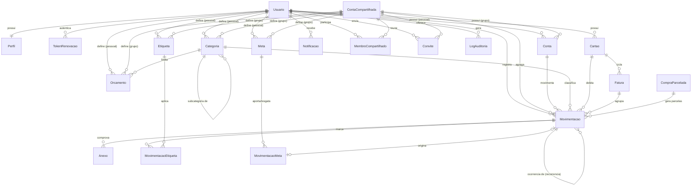

# 03 — Banco de Dados

> **Documento:** Modelagem de Dados
> **Projeto:** Gerenciador de Finanças (PFM)
> **SGBD:** PostgreSQL 16 · **ORM:** Prisma 6
> **Versão:** 1.0.0 · **Data:** 2026-07-29 · **Status:** Vigente

---

## Sumário

1. [Princípios de modelagem](#1-princípios-de-modelagem)
2. [Diagrama ER](#2-diagrama-er)
3. [Enums](#3-enums)
4. [Schema Prisma completo](#4-schema-prisma-completo)
5. [Dicionário de dados](#5-dicionário-de-dados)
6. [Constraints não expressáveis no Prisma](#6-constraints-não-expressáveis-no-prisma)
7. [Índices e desempenho](#7-índices-e-desempenho)
8. [Consultas críticas](#8-consultas-críticas)
9. [Migrations](#9-migrations)
10. [Seed](#10-seed)
11. [Backup e restauração](#11-backup-e-restauração)

---

## 1. Princípios de modelagem

| Princípio               | Regra                                                                                                                                                                                  |
| ----------------------- | -------------------------------------------------------------------------------------------------------------------------------------------------------------------------------------- |
| **Idioma**              | Modelos em `PascalCase` pt-BR; tabelas em `snake_case` plural pt-BR via `@@map`; colunas em `camelCase` no Prisma, mapeadas para `snake_case` no banco via `@map`.                     |
| **Identificadores**     | `String` com `@default(cuid())`. Não há IDs sequenciais expostos — evita enumeração de recursos.                                                                                       |
| **Dinheiro**            | `Decimal @db.Decimal(14, 2)`. Nunca `Float`. Ver ADR-012.                                                                                                                              |
| **Datas de calendário** | `DateTime @db.Date` para competência, vencimento e efetivação (o dia importa, a hora não).                                                                                             |
| **Timestamps**          | `DateTime @db.Timestamptz(3)` para `criadoEm`, `atualizadoEm` e demais instantes. Sempre UTC no banco; conversão para o _timezone_ do perfil ocorre na aplicação.                      |
| **Exclusão lógica**     | Entidades com valor histórico têm `excluidoEm DateTime?`. Nenhuma consulta de domínio ignora esse filtro.                                                                              |
| **Auditoria**           | `criadoEm` e `atualizadoEm` em toda entidade mutável.                                                                                                                                  |
| **Escopo dual**         | Entidades compartilháveis (`Conta`, `Categoria`, `Movimentacao`, `Meta`, `Orcamento`, `Etiqueta`) pertencem a um usuário **ou** a uma conta compartilhada, garantido por `CHECK` (§6). |
| **Cascatas**            | `onDelete: Cascade` apenas onde o filho não tem sentido sem o pai (perfil, tokens, vínculos N:N). Dados financeiros usam `Restrict` — perder histórico por cascata é inaceitável.      |

### 1.1 Desvios deliberados de `specs/SPEC.md §22`

| Entidade original                        | Decisão nesta modelagem                                                                      | Justificativa                                                                                                                                                                                                  |
| ---------------------------------------- | -------------------------------------------------------------------------------------------- | -------------------------------------------------------------------------------------------------------------------------------------------------------------------------------------------------------------- |
| `Installment` (`parcelas`)               | Substituída por `CompraParcelada` + campos `numeroParcela`/`totalParcelas` em `Movimentacao` | RN-22 define que cada parcela **é** uma movimentação. Uma tabela paralela de parcelas duplicaria o mesmo fato em dois lugares, com risco de divergência. `CompraParcelada` guarda apenas o agregado da compra. |
| `Transaction` sem vínculo de par         | `Movimentacao` com `transferenciaId` + `sentido`                                             | ADR-007: cada conta precisa do próprio lançamento no extrato.                                                                                                                                                  |
| Entidades em inglês                      | Todas renomeadas para pt-BR                                                                  | ADR-003.                                                                                                                                                                                                       |
| `Profile` com dados duplicados de `User` | `Perfil` contém apenas preferências; identidade permanece em `Usuario`                       | Evita dois donos do mesmo dado.                                                                                                                                                                                |

---

## 2. Diagrama ER



---

## 3. Enums

```prisma
enum TemaPreferido {
  CLARO
  ESCURO
  SISTEMA
}

enum TipoConta {
  CARTEIRA
  CONTA_CORRENTE
  POUPANCA
  INVESTIMENTO
  DINHEIRO
  OUTRO
}

enum TipoMovimentacao {
  RECEITA
  DESPESA
  TRANSFERENCIA
}

/// Para receitas, PAGA significa "recebida". Ver RF-29.
enum SituacaoMovimentacao {
  PENDENTE
  PAGA
  PAGA_PARCIALMENTE
  ATRASADA
  CANCELADA
}

enum SentidoTransferencia {
  SAIDA
  ENTRADA
}

enum TipoCategoria {
  RECEITA
  DESPESA
  AMBOS
}

enum FrequenciaRecorrencia {
  DIARIA
  SEMANAL
  QUINZENAL
  MENSAL
  BIMESTRAL
  TRIMESTRAL
  SEMESTRAL
  ANUAL
}

enum BandeiraCartao {
  VISA
  MASTERCARD
  ELO
  AMERICAN_EXPRESS
  HIPERCARD
  OUTRA
}

enum SituacaoFatura {
  ABERTA
  FECHADA
  PAGA
  PAGA_PARCIALMENTE
}

enum PapelMembro {
  ADMINISTRADOR
  PARTICIPANTE
  OBSERVADOR
}

enum SituacaoMembro {
  ATIVO
  REMOVIDO
  SAIU
}

enum SituacaoConvite {
  PENDENTE
  ACEITO
  RECUSADO
  CANCELADO
  EXPIRADO
}

enum SituacaoMeta {
  ATIVA
  PAUSADA
  CONCLUIDA
  CANCELADA
}

enum TipoMovimentacaoMeta {
  APORTE
  RESGATE
}

enum TipoNotificacao {
  RECEITA_PREVISTA
  DESPESA_A_VENCER
  DESPESA_ATRASADA
  FATURA_FECHADA
  FATURA_A_VENCER
  ORCAMENTO_80
  ORCAMENTO_90
  ORCAMENTO_100
  META_CONCLUIDA
  META_PRAZO_PROXIMO
  CONVITE_RECEBIDO
  CONVITE_ACEITO
  MEMBRO_REMOVIDO
  ADMINISTRACAO_TRANSFERIDA
  SISTEMA
}

enum AcaoAuditoria {
  CRIAR
  ATUALIZAR
  EXCLUIR
  RESTAURAR
  LOGIN
  LOGOUT
  ALTERAR_SENHA
  RECUPERAR_SENHA
  CONVIDAR
  ACEITAR_CONVITE
  RECUSAR_CONVITE
  REMOVER_MEMBRO
  ALTERAR_PAPEL
  TRANSFERIR_ADMINISTRACAO
  PAGAR
  EXPORTAR
}
```

---

## 4. Schema Prisma completo

Arquivo: `backend/prisma/schema.prisma`

```prisma
generator client {
  provider = "prisma-client-js"
}

datasource db {
  provider = "postgresql"
  url      = env("DATABASE_URL")
}

// ═══════════════════════════════════════════════════════════
//  IDENTIDADE E ACESSO
// ═══════════════════════════════════════════════════════════

model Usuario {
  id                       String    @id @default(cuid())
  nome                     String    @db.VarChar(120)
  email                    String    @unique @db.VarChar(180)
  senhaHash                String    @map("senha_hash") @db.VarChar(72)

  emailVerificadoEm        DateTime? @map("email_verificado_em") @db.Timestamptz(3)
  tokenVerificacao         String?   @unique @map("token_verificacao") @db.VarChar(128)
  tokenVerificacaoExpiraEm DateTime? @map("token_verificacao_expira_em") @db.Timestamptz(3)

  tokenRecuperacao         String?   @unique @map("token_recuperacao") @db.VarChar(128)
  tokenRecuperacaoExpiraEm DateTime? @map("token_recuperacao_expira_em") @db.Timestamptz(3)

  tentativasLogin          Int       @default(0) @map("tentativas_login")
  bloqueadoAte             DateTime? @map("bloqueado_ate") @db.Timestamptz(3)
  ultimoLoginEm            DateTime? @map("ultimo_login_em") @db.Timestamptz(3)

  criadoEm                 DateTime  @default(now()) @map("criado_em") @db.Timestamptz(3)
  atualizadoEm             DateTime  @updatedAt @map("atualizado_em") @db.Timestamptz(3)
  excluidoEm               DateTime? @map("excluido_em") @db.Timestamptz(3)
  anonimizadoEm            DateTime? @map("anonimizado_em") @db.Timestamptz(3)

  perfil                   Perfil?
  tokensRenovacao          TokenRenovacao[]
  contas                   Conta[]
  categorias               Categoria[]
  movimentacoes            Movimentacao[]
  cartoes                  Cartao[]
  comprasParceladas        CompraParcelada[]
  metas                    Meta[]
  orcamentos               Orcamento[]
  etiquetas                Etiqueta[]
  anexos                   Anexo[]
  notificacoes             Notificacao[]
  logsAuditoria            LogAuditoria[]

  membros                  MembroCompartilhado[]
  gruposCriados            ContaCompartilhada[]  @relation("GrupoCriadoPor")
  convitesEnviados         Convite[]             @relation("ConviteEnviadoPor")
  convitesRecebidos        Convite[]             @relation("ConviteUsuarioConvidado")
  membrosConvidados        MembroCompartilhado[] @relation("MembroConvidadoPor")

  @@index([excluidoEm])
  @@map("usuarios")
}

model Perfil {
  id                String        @id @default(cuid())
  usuarioId         String        @unique @map("usuario_id")

  fotoUrl           String?       @map("foto_url") @db.VarChar(500)
  moedaPadrao       String        @default("BRL") @map("moeda_padrao") @db.Char(3)
  idioma            String        @default("pt-BR") @db.VarChar(10)
  tema              TemaPreferido @default(SISTEMA)
  timezone          String        @default("America/Sao_Paulo") @db.VarChar(64)
  formatoData       String        @default("dd/MM/yyyy") @map("formato_data") @db.VarChar(20)
  primeiroDiaSemana Int           @default(0) @map("primeiro_dia_semana")

  notificacoesApp   Boolean       @default(true) @map("notificacoes_app")
  notificacoesEmail Boolean       @default(true) @map("notificacoes_email")

  criadoEm          DateTime      @default(now()) @map("criado_em") @db.Timestamptz(3)
  atualizadoEm      DateTime      @updatedAt @map("atualizado_em") @db.Timestamptz(3)

  usuario           Usuario       @relation(fields: [usuarioId], references: [id], onDelete: Cascade)

  @@map("perfis")
}

model TokenRenovacao {
  id               String    @id @default(cuid())
  usuarioId        String    @map("usuario_id")
  tokenHash        String    @unique @map("token_hash") @db.VarChar(128)

  dispositivo      String?   @db.VarChar(120)
  ip               String?   @db.VarChar(64)
  userAgent        String?   @map("user_agent") @db.VarChar(300)

  expiraEm         DateTime  @map("expira_em") @db.Timestamptz(3)
  revogadoEm       DateTime? @map("revogado_em") @db.Timestamptz(3)
  substituidoPorId String?   @map("substituido_por_id")

  criadoEm         DateTime  @default(now()) @map("criado_em") @db.Timestamptz(3)

  usuario          Usuario   @relation(fields: [usuarioId], references: [id], onDelete: Cascade)

  @@index([usuarioId, revogadoEm])
  @@index([expiraEm])
  @@map("tokens_renovacao")
}

// ═══════════════════════════════════════════════════════════
//  CONTAS COMPARTILHADAS
// ═══════════════════════════════════════════════════════════

model ContaCompartilhada {
  id                                String    @id @default(cuid())
  nome                              String    @db.VarChar(120)
  descricao                         String?   @db.VarChar(500)
  imagemUrl                         String?   @map("imagem_url") @db.VarChar(500)
  moeda                             String    @default("BRL") @db.Char(3)
  cor                               String    @default("#2563EB") @db.VarChar(9)

  /// RN-31: permite ao PARTICIPANTE editar/excluir as próprias movimentações.
  permiteParticipanteEditarProprias Boolean   @default(true) @map("permite_participante_editar_proprias")

  criadoPorId                       String    @map("criado_por_id")
  criadoEm                          DateTime  @default(now()) @map("criado_em") @db.Timestamptz(3)
  atualizadoEm                      DateTime  @updatedAt @map("atualizado_em") @db.Timestamptz(3)
  excluidoEm                        DateTime? @map("excluido_em") @db.Timestamptz(3)

  criadoPor                         Usuario   @relation("GrupoCriadoPor", fields: [criadoPorId], references: [id], onDelete: Restrict)

  membros                           MembroCompartilhado[]
  convites                          Convite[]
  contas                            Conta[]
  categorias                        Categoria[]
  movimentacoes                     Movimentacao[]
  metas                             Meta[]
  orcamentos                        Orcamento[]
  etiquetas                         Etiqueta[]
  logsAuditoria                     LogAuditoria[]

  @@index([criadoPorId])
  @@index([excluidoEm])
  @@map("contas_compartilhadas")
}

model MembroCompartilhado {
  id                   String             @id @default(cuid())
  contaCompartilhadaId String             @map("conta_compartilhada_id")
  usuarioId            String             @map("usuario_id")

  papel                PapelMembro        @default(PARTICIPANTE)
  situacao             SituacaoMembro     @default(ATIVO)

  entrouEm             DateTime           @default(now()) @map("entrou_em") @db.Timestamptz(3)
  saiuEm               DateTime?          @map("saiu_em") @db.Timestamptz(3)
  convidadoPorId       String?            @map("convidado_por_id")

  criadoEm             DateTime           @default(now()) @map("criado_em") @db.Timestamptz(3)
  atualizadoEm         DateTime           @updatedAt @map("atualizado_em") @db.Timestamptz(3)

  contaCompartilhada   ContaCompartilhada @relation(fields: [contaCompartilhadaId], references: [id], onDelete: Cascade)
  usuario              Usuario            @relation(fields: [usuarioId], references: [id], onDelete: Cascade)
  convidadoPor         Usuario?           @relation("MembroConvidadoPor", fields: [convidadoPorId], references: [id], onDelete: SetNull)

  @@unique([contaCompartilhadaId, usuarioId])
  @@index([usuarioId, situacao])
  @@index([contaCompartilhadaId, papel])
  @@map("membros_compartilhados")
}

model Convite {
  id                   String             @id @default(cuid())
  contaCompartilhadaId String             @map("conta_compartilhada_id")
  email                String             @db.VarChar(180)
  papel                PapelMembro        @default(PARTICIPANTE)

  token                String             @unique @db.VarChar(128)
  situacao             SituacaoConvite    @default(PENDENTE)
  mensagem             String?            @db.VarChar(300)

  enviadoPorId         String             @map("enviado_por_id")
  usuarioConvidadoId   String?            @map("usuario_convidado_id")

  expiraEm             DateTime           @map("expira_em") @db.Timestamptz(3)
  respondidoEm         DateTime?          @map("respondido_em") @db.Timestamptz(3)

  criadoEm             DateTime           @default(now()) @map("criado_em") @db.Timestamptz(3)
  atualizadoEm         DateTime           @updatedAt @map("atualizado_em") @db.Timestamptz(3)

  contaCompartilhada   ContaCompartilhada @relation(fields: [contaCompartilhadaId], references: [id], onDelete: Cascade)
  enviadoPor           Usuario            @relation("ConviteEnviadoPor", fields: [enviadoPorId], references: [id], onDelete: Restrict)
  usuarioConvidado     Usuario?           @relation("ConviteUsuarioConvidado", fields: [usuarioConvidadoId], references: [id], onDelete: SetNull)

  @@index([email, situacao])
  @@index([contaCompartilhadaId, situacao])
  @@index([expiraEm])
  @@map("convites")
}

// ═══════════════════════════════════════════════════════════
//  CONTAS, CATEGORIAS E ETIQUETAS
// ═══════════════════════════════════════════════════════════

model Conta {
  id                   String              @id @default(cuid())

  /// Escopo XOR: usuarioId OU contaCompartilhadaId. Ver CHECK chk_conta_escopo.
  usuarioId            String?             @map("usuario_id")
  contaCompartilhadaId String?             @map("conta_compartilhada_id")

  nome                 String              @db.VarChar(120)
  tipo                 TipoConta
  instituicao          String?             @db.VarChar(120)
  saldoInicial         Decimal             @default(0) @map("saldo_inicial") @db.Decimal(14, 2)
  moeda                String              @default("BRL") @db.Char(3)
  cor                  String              @default("#2563EB") @db.VarChar(9)
  icone                String              @default("wallet") @db.VarChar(40)

  incluirNoSaldoTotal  Boolean             @default(true) @map("incluir_no_saldo_total")
  ordem                Int                 @default(0)

  arquivadaEm          DateTime?           @map("arquivada_em") @db.Timestamptz(3)
  criadoEm             DateTime            @default(now()) @map("criado_em") @db.Timestamptz(3)
  atualizadoEm         DateTime            @updatedAt @map("atualizado_em") @db.Timestamptz(3)
  excluidoEm           DateTime?           @map("excluido_em") @db.Timestamptz(3)

  usuario              Usuario?            @relation(fields: [usuarioId], references: [id], onDelete: Cascade)
  contaCompartilhada   ContaCompartilhada? @relation(fields: [contaCompartilhadaId], references: [id], onDelete: Cascade)

  movimentacoes        Movimentacao[]
  cartoesComoPagamento Cartao[]            @relation("ContaPagamentoPadrao")
  movimentacoesMeta    MovimentacaoMeta[]

  @@index([usuarioId, excluidoEm, arquivadaEm])
  @@index([contaCompartilhadaId, excluidoEm])
  @@map("contas")
}

model Categoria {
  id                   String              @id @default(cuid())

  /// Escopo: usuarioId, contaCompartilhadaId, ou ambos nulos quando ehPadraoSistema.
  usuarioId            String?             @map("usuario_id")
  contaCompartilhadaId String?             @map("conta_compartilhada_id")
  categoriaPaiId       String?             @map("categoria_pai_id")

  nome                 String              @db.VarChar(80)
  tipo                 TipoCategoria       @default(DESPESA)
  cor                  String              @default("#64748B") @db.VarChar(9)
  icone                String              @default("tag") @db.VarChar(40)
  ehPadraoSistema      Boolean             @default(false) @map("eh_padrao_sistema")
  ordem                Int                 @default(0)

  criadoEm             DateTime            @default(now()) @map("criado_em") @db.Timestamptz(3)
  atualizadoEm         DateTime            @updatedAt @map("atualizado_em") @db.Timestamptz(3)
  excluidoEm           DateTime?           @map("excluido_em") @db.Timestamptz(3)

  usuario              Usuario?            @relation(fields: [usuarioId], references: [id], onDelete: Cascade)
  contaCompartilhada   ContaCompartilhada? @relation(fields: [contaCompartilhadaId], references: [id], onDelete: Cascade)
  categoriaPai         Categoria?          @relation("Subcategoria", fields: [categoriaPaiId], references: [id], onDelete: Restrict)
  subcategorias        Categoria[]         @relation("Subcategoria")

  movimentacoes        Movimentacao[]
  orcamentos           Orcamento[]

  @@index([usuarioId, tipo, excluidoEm])
  @@index([contaCompartilhadaId, tipo, excluidoEm])
  @@index([categoriaPaiId])
  @@map("categorias")
}

model Etiqueta {
  id                   String              @id @default(cuid())
  usuarioId            String?             @map("usuario_id")
  contaCompartilhadaId String?             @map("conta_compartilhada_id")

  nome                 String              @db.VarChar(40)
  cor                  String              @default("#64748B") @db.VarChar(9)

  criadoEm             DateTime            @default(now()) @map("criado_em") @db.Timestamptz(3)
  atualizadoEm         DateTime            @updatedAt @map("atualizado_em") @db.Timestamptz(3)

  usuario              Usuario?            @relation(fields: [usuarioId], references: [id], onDelete: Cascade)
  contaCompartilhada   ContaCompartilhada? @relation(fields: [contaCompartilhadaId], references: [id], onDelete: Cascade)

  movimentacoes        MovimentacaoEtiqueta[]

  @@index([usuarioId])
  @@index([contaCompartilhadaId])
  @@map("etiquetas")
}

model MovimentacaoEtiqueta {
  movimentacaoId String       @map("movimentacao_id")
  etiquetaId     String       @map("etiqueta_id")
  criadoEm       DateTime     @default(now()) @map("criado_em") @db.Timestamptz(3)

  movimentacao   Movimentacao @relation(fields: [movimentacaoId], references: [id], onDelete: Cascade)
  etiqueta       Etiqueta     @relation(fields: [etiquetaId], references: [id], onDelete: Cascade)

  @@id([movimentacaoId, etiquetaId])
  @@index([etiquetaId])
  @@map("movimentacoes_etiquetas")
}

// ═══════════════════════════════════════════════════════════
//  CARTÕES E FATURAS
// ═══════════════════════════════════════════════════════════

model Cartao {
  id                        String         @id @default(cuid())
  usuarioId                 String         @map("usuario_id")

  nome                      String         @db.VarChar(80)
  bandeira                  BandeiraCartao @default(OUTRA)
  ultimosDigitos            String?        @map("ultimos_digitos") @db.Char(4)
  limiteTotal               Decimal        @map("limite_total") @db.Decimal(14, 2)

  /// 1..31. Quando o mês tiver menos dias, usa-se o último dia (RN-41).
  diaFechamento             Int            @map("dia_fechamento")
  diaVencimento             Int            @map("dia_vencimento")

  contaPagamentoPadraoId    String?        @map("conta_pagamento_padrao_id")
  cor                       String         @default("#7C3AED") @db.VarChar(9)
  ativo                     Boolean        @default(true)

  criadoEm                  DateTime       @default(now()) @map("criado_em") @db.Timestamptz(3)
  atualizadoEm              DateTime       @updatedAt @map("atualizado_em") @db.Timestamptz(3)
  excluidoEm                DateTime?      @map("excluido_em") @db.Timestamptz(3)

  usuario                   Usuario        @relation(fields: [usuarioId], references: [id], onDelete: Cascade)
  contaPagamentoPadrao      Conta?         @relation("ContaPagamentoPadrao", fields: [contaPagamentoPadraoId], references: [id], onDelete: SetNull)

  faturas                   Fatura[]
  movimentacoes             Movimentacao[]
  comprasParceladas         CompraParcelada[]

  @@index([usuarioId, excluidoEm])
  @@map("cartoes")
}

model Fatura {
  id                     String         @id @default(cuid())
  cartaoId               String         @map("cartao_id")

  ano                    Int
  mes                    Int
  dataFechamento         DateTime       @map("data_fechamento") @db.Date
  dataVencimento         DateTime       @map("data_vencimento") @db.Date

  valorTotal             Decimal        @default(0) @map("valor_total") @db.Decimal(14, 2)
  valorPago              Decimal        @default(0) @map("valor_pago") @db.Decimal(14, 2)
  situacao               SituacaoFatura @default(ABERTA)

  fechadaEm              DateTime?      @map("fechada_em") @db.Timestamptz(3)
  pagaEm                 DateTime?      @map("paga_em") @db.Timestamptz(3)
  movimentacaoPagamentoId String?       @unique @map("movimentacao_pagamento_id")

  criadoEm               DateTime       @default(now()) @map("criado_em") @db.Timestamptz(3)
  atualizadoEm           DateTime       @updatedAt @map("atualizado_em") @db.Timestamptz(3)

  cartao                 Cartao         @relation(fields: [cartaoId], references: [id], onDelete: Cascade)
  movimentacaoPagamento  Movimentacao?  @relation("PagamentoFatura", fields: [movimentacaoPagamentoId], references: [id], onDelete: SetNull)
  movimentacoes          Movimentacao[] @relation("ItensFatura")

  @@unique([cartaoId, ano, mes])
  @@index([cartaoId, situacao])
  @@index([dataVencimento, situacao])
  @@map("faturas")
}

model CompraParcelada {
  id            String         @id @default(cuid())
  usuarioId     String         @map("usuario_id")
  cartaoId      String?        @map("cartao_id")

  descricao     String         @db.VarChar(200)
  valorTotal    Decimal        @map("valor_total") @db.Decimal(14, 2)
  totalParcelas Int            @map("total_parcelas")
  dataCompra    DateTime       @map("data_compra") @db.Date

  criadoEm      DateTime       @default(now()) @map("criado_em") @db.Timestamptz(3)
  atualizadoEm  DateTime       @updatedAt @map("atualizado_em") @db.Timestamptz(3)
  excluidoEm    DateTime?      @map("excluido_em") @db.Timestamptz(3)

  usuario       Usuario        @relation(fields: [usuarioId], references: [id], onDelete: Cascade)
  cartao        Cartao?        @relation(fields: [cartaoId], references: [id], onDelete: Cascade)
  parcelas      Movimentacao[] @relation("ParcelasDaCompra")

  @@index([usuarioId, excluidoEm])
  @@index([cartaoId])
  @@map("compras_parceladas")
}

// ═══════════════════════════════════════════════════════════
//  MOVIMENTAÇÕES  (entidade central)
// ═══════════════════════════════════════════════════════════

model Movimentacao {
  id                   String                 @id @default(cuid())

  /// Autor do lançamento. Sempre preenchido, inclusive em grupo (RF-59).
  usuarioId            String                 @map("usuario_id")

  /// Escopo XOR: contaId (pessoal) OU contaCompartilhadaId (grupo). Ver chk_mov_escopo.
  contaId              String?                @map("conta_id")
  contaCompartilhadaId String?                @map("conta_compartilhada_id")

  categoriaId          String?                @map("categoria_id")

  tipo                 TipoMovimentacao
  descricao            String                 @db.VarChar(200)
  observacao           String?                @db.VarChar(1000)

  /// Sempre positivo. O sinal vem de `tipo` (RN-08).
  valor                Decimal                @db.Decimal(14, 2)
  valorPago            Decimal                @default(0) @map("valor_pago") @db.Decimal(14, 2)
  situacao             SituacaoMovimentacao   @default(PENDENTE)

  /// Data de referência contábil — base dos relatórios (RN-12).
  dataCompetencia      DateTime               @map("data_competencia") @db.Date
  dataVencimento       DateTime?              @map("data_vencimento") @db.Date
  /// Data em que o dinheiro efetivamente entrou/saiu — base do saldo (RN-12).
  dataEfetivacao       DateTime?              @map("data_efetivacao") @db.Date

  // ---- Transferência (ADR-007) ----
  transferenciaId      String?                @map("transferencia_id")
  sentido              SentidoTransferencia?

  // ---- Recorrência (ADR-006) ----
  ehModeloRecorrencia  Boolean                @default(false) @map("eh_modelo_recorrencia")
  recorrenciaId        String?                @map("recorrencia_id")
  frequencia           FrequenciaRecorrencia?
  intervaloRecorrencia Int?                   @map("intervalo_recorrencia")
  recorrenciaFimEm     DateTime?              @map("recorrencia_fim_em") @db.Date
  recorrenciaTotal     Int?                   @map("recorrencia_total")

  // ---- Parcelamento (RN-21, RN-22) ----
  compraParceladaId    String?                @map("compra_parcelada_id")
  numeroParcela        Int?                   @map("numero_parcela")
  totalParcelas        Int?                   @map("total_parcelas")

  // ---- Cartão ----
  cartaoId             String?                @map("cartao_id")
  faturaId             String?                @map("fatura_id")

  criadoEm             DateTime               @default(now()) @map("criado_em") @db.Timestamptz(3)
  atualizadoEm         DateTime               @updatedAt @map("atualizado_em") @db.Timestamptz(3)
  excluidoEm           DateTime?              @map("excluido_em") @db.Timestamptz(3)

  usuario              Usuario                @relation(fields: [usuarioId], references: [id], onDelete: Restrict)
  conta                Conta?                 @relation(fields: [contaId], references: [id], onDelete: Restrict)
  contaCompartilhada   ContaCompartilhada?    @relation(fields: [contaCompartilhadaId], references: [id], onDelete: Restrict)
  categoria            Categoria?             @relation(fields: [categoriaId], references: [id], onDelete: Restrict)
  cartao               Cartao?                @relation(fields: [cartaoId], references: [id], onDelete: Restrict)
  fatura               Fatura?                @relation("ItensFatura", fields: [faturaId], references: [id], onDelete: SetNull)
  compraParcelada      CompraParcelada?       @relation("ParcelasDaCompra", fields: [compraParceladaId], references: [id], onDelete: Cascade)

  modeloRecorrencia    Movimentacao?          @relation("OcorrenciasRecorrencia", fields: [recorrenciaId], references: [id], onDelete: Cascade)
  ocorrencias          Movimentacao[]         @relation("OcorrenciasRecorrencia")

  faturaPaga           Fatura?                @relation("PagamentoFatura")
  anexos               Anexo[]
  etiquetas            MovimentacaoEtiqueta[]
  movimentacaoMeta     MovimentacaoMeta?

  // Índices dirigidos às consultas de §8
  @@index([contaId, situacao, dataEfetivacao])
  @@index([usuarioId, dataCompetencia, tipo])
  @@index([contaCompartilhadaId, dataCompetencia])
  @@index([categoriaId, dataCompetencia])
  @@index([situacao, dataVencimento])
  @@index([transferenciaId])
  @@index([recorrenciaId])
  @@index([compraParceladaId])
  @@index([faturaId])
  @@index([excluidoEm])
  @@map("movimentacoes")
}

model Anexo {
  id             String       @id @default(cuid())
  movimentacaoId String       @map("movimentacao_id")
  usuarioId      String       @map("usuario_id")

  nomeOriginal   String       @map("nome_original") @db.VarChar(255)
  nomeArmazenado String       @map("nome_armazenado") @db.VarChar(255)
  caminho        String       @db.VarChar(500)
  tipoMime       String       @map("tipo_mime") @db.VarChar(100)
  tamanhoBytes   Int          @map("tamanho_bytes")

  criadoEm       DateTime     @default(now()) @map("criado_em") @db.Timestamptz(3)

  movimentacao   Movimentacao @relation(fields: [movimentacaoId], references: [id], onDelete: Cascade)
  usuario        Usuario      @relation(fields: [usuarioId], references: [id], onDelete: Restrict)

  @@index([movimentacaoId])
  @@index([usuarioId])
  @@map("anexos")
}

// ═══════════════════════════════════════════════════════════
//  METAS E ORÇAMENTOS
// ═══════════════════════════════════════════════════════════

model Meta {
  id                   String              @id @default(cuid())
  usuarioId            String?             @map("usuario_id")
  contaCompartilhadaId String?             @map("conta_compartilhada_id")

  nome                 String              @db.VarChar(120)
  descricao            String?             @db.VarChar(500)
  valorAlvo            Decimal             @map("valor_alvo") @db.Decimal(14, 2)
  /// Derivado de MovimentacaoMeta; recalculado a cada aporte/resgate na mesma transação.
  valorAcumulado       Decimal             @default(0) @map("valor_acumulado") @db.Decimal(14, 2)

  prazoEm              DateTime?           @map("prazo_em") @db.Date
  cor                  String              @default("#16A34A") @db.VarChar(9)
  icone                String              @default("target") @db.VarChar(40)
  situacao             SituacaoMeta        @default(ATIVA)
  concluidaEm          DateTime?           @map("concluida_em") @db.Timestamptz(3)

  criadoEm             DateTime            @default(now()) @map("criado_em") @db.Timestamptz(3)
  atualizadoEm         DateTime            @updatedAt @map("atualizado_em") @db.Timestamptz(3)
  excluidoEm           DateTime?           @map("excluido_em") @db.Timestamptz(3)

  usuario              Usuario?            @relation(fields: [usuarioId], references: [id], onDelete: Cascade)
  contaCompartilhada   ContaCompartilhada? @relation(fields: [contaCompartilhadaId], references: [id], onDelete: Cascade)
  movimentacoes        MovimentacaoMeta[]

  @@index([usuarioId, situacao])
  @@index([contaCompartilhadaId, situacao])
  @@map("metas")
}

model MovimentacaoMeta {
  id             String               @id @default(cuid())
  metaId         String               @map("meta_id")
  contaId        String?              @map("conta_id")
  movimentacaoId String?              @unique @map("movimentacao_id")

  tipo           TipoMovimentacaoMeta
  valor          Decimal              @db.Decimal(14, 2)
  data           DateTime             @db.Date
  observacao     String?              @db.VarChar(500)

  criadoEm       DateTime             @default(now()) @map("criado_em") @db.Timestamptz(3)

  meta           Meta                 @relation(fields: [metaId], references: [id], onDelete: Cascade)
  conta          Conta?               @relation(fields: [contaId], references: [id], onDelete: SetNull)
  movimentacao   Movimentacao?        @relation(fields: [movimentacaoId], references: [id], onDelete: SetNull)

  @@index([metaId, data])
  @@map("movimentacoes_meta")
}

model Orcamento {
  id                   String              @id @default(cuid())
  usuarioId            String?             @map("usuario_id")
  contaCompartilhadaId String?             @map("conta_compartilhada_id")
  categoriaId          String              @map("categoria_id")

  ano                  Int
  mes                  Int
  valorLimite          Decimal             @map("valor_limite") @db.Decimal(14, 2)

  alerta80EnviadoEm    DateTime?           @map("alerta_80_enviado_em") @db.Timestamptz(3)
  alerta90EnviadoEm    DateTime?           @map("alerta_90_enviado_em") @db.Timestamptz(3)
  alerta100EnviadoEm   DateTime?           @map("alerta_100_enviado_em") @db.Timestamptz(3)

  criadoEm             DateTime            @default(now()) @map("criado_em") @db.Timestamptz(3)
  atualizadoEm         DateTime            @updatedAt @map("atualizado_em") @db.Timestamptz(3)
  excluidoEm           DateTime?           @map("excluido_em") @db.Timestamptz(3)

  usuario              Usuario?            @relation(fields: [usuarioId], references: [id], onDelete: Cascade)
  contaCompartilhada   ContaCompartilhada? @relation(fields: [contaCompartilhadaId], references: [id], onDelete: Cascade)
  categoria            Categoria           @relation(fields: [categoriaId], references: [id], onDelete: Restrict)

  @@index([usuarioId, ano, mes])
  @@index([contaCompartilhadaId, ano, mes])
  @@index([categoriaId])
  @@map("orcamentos")
}

// ═══════════════════════════════════════════════════════════
//  NOTIFICAÇÕES E AUDITORIA
// ═══════════════════════════════════════════════════════════

model Notificacao {
  id           String          @id @default(cuid())
  usuarioId    String          @map("usuario_id")

  tipo         TipoNotificacao
  titulo       String          @db.VarChar(150)
  mensagem     String          @db.VarChar(500)

  entidadeTipo String?         @map("entidade_tipo") @db.VarChar(50)
  entidadeId   String?         @map("entidade_id")
  urlAcao      String?         @map("url_acao") @db.VarChar(300)

  lidaEm       DateTime?       @map("lida_em") @db.Timestamptz(3)
  criadoEm     DateTime        @default(now()) @map("criado_em") @db.Timestamptz(3)

  usuario      Usuario         @relation(fields: [usuarioId], references: [id], onDelete: Cascade)

  @@index([usuarioId, lidaEm, criadoEm])
  @@map("notificacoes")
}

model LogAuditoria {
  id                   String              @id @default(cuid())
  usuarioId            String?             @map("usuario_id")
  contaCompartilhadaId String?             @map("conta_compartilhada_id")

  acao                 AcaoAuditoria
  entidadeTipo         String              @map("entidade_tipo") @db.VarChar(50)
  entidadeId           String?             @map("entidade_id")

  estadoAnterior       Json?               @map("estado_anterior")
  estadoNovo           Json?               @map("estado_novo")

  ip                   String?             @db.VarChar(64)
  userAgent            String?             @map("user_agent") @db.VarChar(300)
  requestId            String?             @map("request_id") @db.VarChar(64)

  criadoEm             DateTime            @default(now()) @map("criado_em") @db.Timestamptz(3)

  usuario              Usuario?            @relation(fields: [usuarioId], references: [id], onDelete: SetNull)
  contaCompartilhada   ContaCompartilhada? @relation(fields: [contaCompartilhadaId], references: [id], onDelete: Cascade)

  @@index([usuarioId, criadoEm])
  @@index([contaCompartilhadaId, criadoEm])
  @@index([entidadeTipo, entidadeId])
  @@map("logs_auditoria")
}
```

---

## 5. Dicionário de dados

Apenas os campos cuja semântica não é evidente pelo nome. Os demais são autoexplicativos.

### 5.1 `movimentacoes`

| Coluna                              | Tipo            | Semântica                                                                                                                                    |
| ----------------------------------- | --------------- | -------------------------------------------------------------------------------------------------------------------------------------------- |
| `usuario_id`                        | FK              | **Autor** do lançamento — não necessariamente o proprietário do dinheiro. Em grupo, é quem registrou (RF-59).                                |
| `conta_id`                          | FK?             | Conta pessoal afetada. Nulo em movimentação de grupo.                                                                                        |
| `conta_compartilhada_id`            | FK?             | Grupo afetado. Nulo em movimentação pessoal. Exatamente um dos dois é não-nulo.                                                              |
| `valor`                             | `Decimal(14,2)` | Sempre `> 0`. O efeito no saldo é definido por `tipo` e `sentido`.                                                                           |
| `valor_pago`                        | `Decimal(14,2)` | Quanto já foi efetivamente pago/recebido. Igual a `valor` quando `situacao = PAGA`. Base do impacto no saldo em `PAGA_PARCIALMENTE` (RN-03). |
| `data_competencia`                  | `date`          | Mês contábil ao qual pertence. **Base de relatórios e orçamentos.**                                                                          |
| `data_vencimento`                   | `date?`         | Quando deveria ser pago. Base do cálculo de atraso (RF-30) e das notificações.                                                               |
| `data_efetivacao`                   | `date?`         | Quando o dinheiro se moveu. **Base do saldo atual.** Nulo enquanto pendente.                                                                 |
| `transferencia_id`                  | `text?`         | UUID que une os dois lados de uma transferência. Ambos os lados compartilham o valor (ADR-007).                                              |
| `sentido`                           | enum?           | `SAIDA` na conta de origem, `ENTRADA` na de destino. Obrigatório quando `tipo = TRANSFERENCIA`, nulo caso contrário.                         |
| `eh_modelo_recorrencia`             | `bool`          | `true` no registro-mãe, que **não** entra em saldos nem listagens; serve apenas de molde (RN-17).                                            |
| `recorrencia_id`                    | FK?             | Aponta para o registro-mãe. Nulo em movimentação avulsa e no próprio registro-mãe.                                                           |
| `intervalo_recorrencia`             | `int?`          | Multiplicador da frequência. `frequencia = MENSAL` + `intervalo = 3` ⇒ a cada 3 meses.                                                       |
| `compra_parcelada_id`               | FK?             | Vincula a parcela à compra-mãe.                                                                                                              |
| `numero_parcela` / `total_parcelas` | `int?`          | Rótulo `x/N` (RN-22).                                                                                                                        |
| `fatura_id`                         | FK?             | Fatura à qual a despesa de cartão foi alocada (RN-40). Preenchido pelo serviço, nunca pelo cliente.                                          |
| `excluido_em`                       | `timestamptz?`  | Exclusão lógica (RN-16). Todo filtro de domínio inclui `excluido_em IS NULL`.                                                                |

### 5.2 `contas`

| Coluna                   | Semântica                                                                                                                             |
| ------------------------ | ------------------------------------------------------------------------------------------------------------------------------------- |
| `saldo_inicial`          | Saldo declarado no momento do cadastro. Ponto de partida do cálculo de RN-01.                                                         |
| `incluir_no_saldo_total` | Se `false`, a conta aparece na listagem mas é excluída do saldo consolidado (RN-05). Útil para contas de investimento de longo prazo. |
| `arquivada_em`           | Conta arquivada não aceita novos lançamentos e não aparece em seletores, mas preserva histórico (RF-17).                              |

### 5.3 `faturas`

| Coluna                      | Semântica                                                                               |
| --------------------------- | --------------------------------------------------------------------------------------- |
| `ano` / `mes`               | Identificam o **ciclo**, não a data de vencimento. Chave natural junto com `cartao_id`. |
| `valor_total`               | Soma das movimentações alocadas. Recalculado a cada alocação, dentro da transação.      |
| `movimentacao_pagamento_id` | Despesa gerada na conta pagadora ao liquidar a fatura (RN-45). Relação 1:1.             |

### 5.4 `orcamentos`

| Coluna                      | Semântica                                                                          |
| --------------------------- | ---------------------------------------------------------------------------------- |
| `alerta_80_enviado_em` etc. | Marca de idempotência: garante no máximo um alerta por limiar por período (RN-50). |

---

## 6. Constraints não expressáveis no Prisma

O Prisma Schema não modela `CHECK` nem índices únicos parciais. Estas constraints são adicionadas por **migration manual** e são obrigatórias — sem elas, as regras de negócio dependeriam apenas do código de aplicação.

Arquivo: `prisma/migrations/<timestamp>_constraints_dominio/migration.sql`

```sql
-- ═══════════════════════════════════════════════════════════
--  ESCOPO XOR (pessoal OU compartilhado, nunca ambos)
-- ═══════════════════════════════════════════════════════════

-- RN-09
ALTER TABLE movimentacoes ADD CONSTRAINT chk_mov_escopo CHECK (
  (conta_id IS NOT NULL AND conta_compartilhada_id IS NULL) OR
  (conta_id IS NULL     AND conta_compartilhada_id IS NOT NULL)
);

ALTER TABLE contas ADD CONSTRAINT chk_conta_escopo CHECK (
  (usuario_id IS NOT NULL AND conta_compartilhada_id IS NULL) OR
  (usuario_id IS NULL     AND conta_compartilhada_id IS NOT NULL)
);

ALTER TABLE metas ADD CONSTRAINT chk_meta_escopo CHECK (
  (usuario_id IS NOT NULL AND conta_compartilhada_id IS NULL) OR
  (usuario_id IS NULL     AND conta_compartilhada_id IS NOT NULL)
);

ALTER TABLE orcamentos ADD CONSTRAINT chk_orcamento_escopo CHECK (
  (usuario_id IS NOT NULL AND conta_compartilhada_id IS NULL) OR
  (usuario_id IS NULL     AND conta_compartilhada_id IS NOT NULL)
);

ALTER TABLE etiquetas ADD CONSTRAINT chk_etiqueta_escopo CHECK (
  (usuario_id IS NOT NULL AND conta_compartilhada_id IS NULL) OR
  (usuario_id IS NULL     AND conta_compartilhada_id IS NOT NULL)
);

-- Categoria admite terceiro caso: padrão global do sistema.
ALTER TABLE categorias ADD CONSTRAINT chk_categoria_escopo CHECK (
  (usuario_id IS NOT NULL AND conta_compartilhada_id IS NULL AND eh_padrao_sistema = false) OR
  (usuario_id IS NULL AND conta_compartilhada_id IS NOT NULL AND eh_padrao_sistema = false) OR
  (usuario_id IS NULL AND conta_compartilhada_id IS NULL     AND eh_padrao_sistema = true)
);

-- ═══════════════════════════════════════════════════════════
--  INTEGRIDADE DE VALORES
-- ═══════════════════════════════════════════════════════════

-- RN-08
ALTER TABLE movimentacoes ADD CONSTRAINT chk_mov_valor_positivo
  CHECK (valor > 0);

ALTER TABLE movimentacoes ADD CONSTRAINT chk_mov_valor_pago
  CHECK (valor_pago >= 0 AND valor_pago <= valor);

ALTER TABLE metas ADD CONSTRAINT chk_meta_valor_alvo
  CHECK (valor_alvo > 0);

ALTER TABLE orcamentos ADD CONSTRAINT chk_orcamento_valor
  CHECK (valor_limite > 0);

ALTER TABLE orcamentos ADD CONSTRAINT chk_orcamento_periodo
  CHECK (mes BETWEEN 1 AND 12 AND ano BETWEEN 2000 AND 2100);

ALTER TABLE cartoes ADD CONSTRAINT chk_cartao_limite
  CHECK (limite_total >= 0);

-- RN-41
ALTER TABLE cartoes ADD CONSTRAINT chk_cartao_dias
  CHECK (dia_fechamento BETWEEN 1 AND 31 AND dia_vencimento BETWEEN 1 AND 31);

ALTER TABLE faturas ADD CONSTRAINT chk_fatura_periodo
  CHECK (mes BETWEEN 1 AND 12 AND ano BETWEEN 2000 AND 2100);

-- ═══════════════════════════════════════════════════════════
--  COERÊNCIA DE ESTADO
-- ═══════════════════════════════════════════════════════════

-- `sentido` existe se e somente se for transferência (ADR-007).
ALTER TABLE movimentacoes ADD CONSTRAINT chk_mov_sentido_transferencia CHECK (
  (tipo = 'TRANSFERENCIA' AND sentido IS NOT NULL AND transferencia_id IS NOT NULL) OR
  (tipo <> 'TRANSFERENCIA' AND sentido IS NULL     AND transferencia_id IS NULL)
);

-- Efetivada exige data de efetivação; pendente não pode tê-la (RN-02, RN-14).
ALTER TABLE movimentacoes ADD CONSTRAINT chk_mov_efetivacao CHECK (
  (situacao IN ('PAGA', 'PAGA_PARCIALMENTE') AND data_efetivacao IS NOT NULL) OR
  (situacao IN ('PENDENTE', 'ATRASADA', 'CANCELADA') AND data_efetivacao IS NULL)
);

-- Parcelamento é tudo-ou-nada (RN-22).
ALTER TABLE movimentacoes ADD CONSTRAINT chk_mov_parcelamento CHECK (
  (compra_parcelada_id IS NULL AND numero_parcela IS NULL AND total_parcelas IS NULL) OR
  (compra_parcelada_id IS NOT NULL AND numero_parcela IS NOT NULL
   AND total_parcelas IS NOT NULL AND numero_parcela BETWEEN 1 AND total_parcelas)
);

-- Modelo de recorrência precisa de frequência; e não pode ser filho de outro modelo (RN-17).
ALTER TABLE movimentacoes ADD CONSTRAINT chk_mov_recorrencia CHECK (
  (eh_modelo_recorrencia = false) OR
  (eh_modelo_recorrencia = true AND frequencia IS NOT NULL AND recorrencia_id IS NULL)
);

ALTER TABLE compras_parceladas ADD CONSTRAINT chk_compra_parcelas
  CHECK (total_parcelas >= 2 AND valor_total > 0);

-- ═══════════════════════════════════════════════════════════
--  UNICIDADE PARCIAL  (NULL não colide em UNIQUE do Postgres)
-- ═══════════════════════════════════════════════════════════

-- Nome de conta único por escopo, ignorando excluídas.
CREATE UNIQUE INDEX uq_conta_nome_usuario
  ON contas (usuario_id, lower(nome))
  WHERE usuario_id IS NOT NULL AND excluido_em IS NULL;

CREATE UNIQUE INDEX uq_conta_nome_grupo
  ON contas (conta_compartilhada_id, lower(nome))
  WHERE conta_compartilhada_id IS NOT NULL AND excluido_em IS NULL;

-- Nome de categoria único por escopo e por pai.
CREATE UNIQUE INDEX uq_categoria_nome_usuario
  ON categorias (usuario_id, coalesce(categoria_pai_id, ''), lower(nome))
  WHERE usuario_id IS NOT NULL AND excluido_em IS NULL;

CREATE UNIQUE INDEX uq_categoria_nome_grupo
  ON categorias (conta_compartilhada_id, coalesce(categoria_pai_id, ''), lower(nome))
  WHERE conta_compartilhada_id IS NOT NULL AND excluido_em IS NULL;

-- Etiqueta única por escopo.
CREATE UNIQUE INDEX uq_etiqueta_nome_usuario
  ON etiquetas (usuario_id, lower(nome)) WHERE usuario_id IS NOT NULL;

CREATE UNIQUE INDEX uq_etiqueta_nome_grupo
  ON etiquetas (conta_compartilhada_id, lower(nome)) WHERE conta_compartilhada_id IS NOT NULL;

-- RN-48: um orçamento por categoria/escopo/período.
CREATE UNIQUE INDEX uq_orcamento_usuario_periodo
  ON orcamentos (usuario_id, categoria_id, ano, mes)
  WHERE usuario_id IS NOT NULL AND excluido_em IS NULL;

CREATE UNIQUE INDEX uq_orcamento_grupo_periodo
  ON orcamentos (conta_compartilhada_id, categoria_id, ano, mes)
  WHERE conta_compartilhada_id IS NOT NULL AND excluido_em IS NULL;

-- RN-36: no máximo um convite PENDENTE por e-mail e grupo.
CREATE UNIQUE INDEX uq_convite_pendente
  ON convites (conta_compartilhada_id, lower(email))
  WHERE situacao = 'PENDENTE';

-- RN-28: exatamente um ADMINISTRADOR ativo por grupo.
CREATE UNIQUE INDEX uq_grupo_um_administrador
  ON membros_compartilhados (conta_compartilhada_id)
  WHERE papel = 'ADMINISTRADOR' AND situacao = 'ATIVO';

-- ═══════════════════════════════════════════════════════════
--  ÍNDICES DE APOIO A CONSULTAS ESPECÍFICAS
-- ═══════════════════════════════════════════════════════════

-- Pesquisa textual (RF-80). Requer extensão pg_trgm.
CREATE EXTENSION IF NOT EXISTS pg_trgm;

CREATE INDEX idx_mov_descricao_trgm
  ON movimentacoes USING gin (descricao gin_trgm_ops);

-- Índice parcial para o cálculo de saldo (RN-01): só linhas que afetam saldo.
CREATE INDEX idx_mov_saldo
  ON movimentacoes (conta_id, tipo, sentido)
  INCLUDE (valor_pago)
  WHERE excluido_em IS NULL
    AND eh_modelo_recorrencia = false
    AND situacao IN ('PAGA', 'PAGA_PARCIALMENTE');

-- Índice parcial para a fila de vencimentos/atrasos (RF-30, RF-69).
CREATE INDEX idx_mov_pendentes_vencimento
  ON movimentacoes (data_vencimento, situacao)
  WHERE excluido_em IS NULL
    AND eh_modelo_recorrencia = false
    AND situacao IN ('PENDENTE', 'ATRASADA');
```

> **Nota sobre `uq_grupo_um_administrador`:** o índice único parcial impede _dois_ administradores, mas não impede _zero_. A ausência de administrador é impedida pela lógica de serviço (RN-29: transferência obrigatória antes da saída) e coberta por teste de integração dedicado.

---

## 7. Índices e desempenho

### 7.1 Estratégia

`movimentacoes` é a tabela que cresce e concentra praticamente toda a carga. Os índices foram derivados das consultas reais de §8, não adicionados por intuição.

| Índice                                       | Serve a                                       | Tipo                   |
| -------------------------------------------- | --------------------------------------------- | ---------------------- |
| `(conta_id, situacao, data_efetivacao)`      | Extrato e saldo por conta                     | B-tree composto        |
| `(usuario_id, data_competencia, tipo)`       | Dashboard e relatórios do usuário             | B-tree composto        |
| `(conta_compartilhada_id, data_competencia)` | Extrato de grupo                              | B-tree composto        |
| `(categoria_id, data_competencia)`           | Relatório por categoria, consumo de orçamento | B-tree composto        |
| `(situacao, data_vencimento)`                | Tarefa de atraso, notificações                | B-tree composto        |
| `idx_mov_saldo`                              | Agregação de saldo                            | **Parcial + covering** |
| `idx_mov_pendentes_vencimento`               | Fila de pendências                            | **Parcial**            |
| `idx_mov_descricao_trgm`                     | Pesquisa global por texto                     | **GIN trigram**        |

Os dois índices parciais são os mais valiosos: restringem a leitura às poucas linhas que interessam a operações executadas em toda requisição de dashboard, e o `INCLUDE (valor_pago)` permite _index-only scan_ na soma de saldo.

### 7.2 Ordem das colunas em índices compostos

Regra aplicada: **igualdade antes de faixa**. Em `(conta_id, situacao, data_efetivacao)`, `conta_id` e `situacao` são filtrados por igualdade e `data_efetivacao` por intervalo — nesta ordem o índice é utilizável por inteiro. A ordem inversa desperdiçaria as colunas após a faixa.

### 7.3 Orçamento de desempenho

| Operação                                     | Alvo     | Verificação                              |
| -------------------------------------------- | -------- | ---------------------------------------- |
| Listar movimentações (20 itens, com filtros) | < 120 ms | `EXPLAIN ANALYZE` em teste de integração |
| Saldo consolidado do usuário                 | < 80 ms  | idem                                     |
| Dashboard completo (5 consultas paralelas)   | < 300 ms | teste de carga                           |
| Relatório de 12 meses por categoria          | < 800 ms | idem                                     |

`EXPLAIN ANALYZE` das quatro consultas acima é obrigatório em toda PR que altere consulta ou índice. Qualquer `Seq Scan` em `movimentacoes` reprova a revisão.

---

## 8. Consultas críticas

### 8.1 Saldo atual de uma conta (RN-01, RN-02, RN-03)

```sql
SELECT
  c.saldo_inicial + COALESCE(SUM(
    CASE
      WHEN m.tipo = 'RECEITA'                            THEN  m.valor_pago
      WHEN m.tipo = 'DESPESA'                            THEN -m.valor_pago
      WHEN m.tipo = 'TRANSFERENCIA' AND m.sentido='ENTRADA' THEN  m.valor_pago
      WHEN m.tipo = 'TRANSFERENCIA' AND m.sentido='SAIDA'   THEN -m.valor_pago
    END
  ), 0) AS saldo_atual
FROM contas c
LEFT JOIN movimentacoes m
  ON m.conta_id = c.id
 AND m.excluido_em IS NULL
 AND m.eh_modelo_recorrencia = false
 AND m.situacao IN ('PAGA', 'PAGA_PARCIALMENTE')
WHERE c.id = $1 AND c.excluido_em IS NULL
GROUP BY c.id, c.saldo_inicial;
```

`valor_pago` — não `valor` — é o que entra na soma. É isso que faz `PAGA_PARCIALMENTE` funcionar sem caso especial (RN-03).

### 8.2 Saldo previsto do período (RN-04)

```sql
WITH pendentes AS (
  SELECT
    SUM(CASE WHEN tipo = 'RECEITA' THEN valor
             WHEN tipo = 'DESPESA' THEN -valor
             ELSE 0 END) AS efeito
  FROM movimentacoes
  WHERE conta_id = $1
    AND excluido_em IS NULL
    AND eh_modelo_recorrencia = false
    AND situacao IN ('PENDENTE', 'ATRASADA')
    AND data_vencimento <= $2          -- fim do período
)
SELECT (SELECT saldo_atual FROM vw_saldo_conta WHERE conta_id = $1)
     + COALESCE((SELECT efeito FROM pendentes), 0) AS saldo_previsto;
```

### 8.3 Despesas por categoria no período (RF-42)

```sql
SELECT
  cat.id, cat.nome, cat.cor,
  SUM(m.valor)                                   AS total,
  COUNT(*)                                       AS quantidade,
  ROUND(100.0 * SUM(m.valor) / SUM(SUM(m.valor)) OVER (), 2) AS percentual
FROM movimentacoes m
JOIN categorias cat ON cat.id = m.categoria_id
WHERE m.usuario_id = $1
  AND m.tipo = 'DESPESA'                       -- RN-25: exclui transferências
  AND m.situacao <> 'CANCELADA'
  AND m.excluido_em IS NULL
  AND m.eh_modelo_recorrencia = false
  AND m.data_competencia BETWEEN $2 AND $3
GROUP BY cat.id, cat.nome, cat.cor
ORDER BY total DESC;
```

### 8.4 Fluxo de caixa de 12 meses (RF-41)

```sql
WITH meses AS (
  SELECT generate_series(
    date_trunc('month', $2::date),
    date_trunc('month', $3::date),
    '1 month'
  )::date AS mes
)
SELECT
  ms.mes,
  COALESCE(SUM(CASE WHEN m.tipo = 'RECEITA' THEN m.valor END), 0) AS receitas,
  COALESCE(SUM(CASE WHEN m.tipo = 'DESPESA' THEN m.valor END), 0) AS despesas,
  COALESCE(SUM(CASE WHEN m.tipo = 'RECEITA' THEN m.valor
                    WHEN m.tipo = 'DESPESA' THEN -m.valor END), 0) AS resultado
FROM meses ms
LEFT JOIN movimentacoes m
  ON date_trunc('month', m.data_competencia) = ms.mes
 AND m.usuario_id = $1
 AND m.tipo IN ('RECEITA', 'DESPESA')
 AND m.situacao <> 'CANCELADA'
 AND m.excluido_em IS NULL
 AND m.eh_modelo_recorrencia = false
GROUP BY ms.mes
ORDER BY ms.mes;
```

O `generate_series` garante meses sem movimentação no resultado com valor zero — sem ele, o gráfico apresentaria lacunas e distorceria a leitura da série.

### 8.5 Consumo de orçamento (RN-49)

```sql
SELECT
  o.id, o.valor_limite,
  COALESCE(SUM(m.valor), 0) AS consumido,
  CASE WHEN o.valor_limite > 0
       THEN ROUND(100.0 * COALESCE(SUM(m.valor), 0) / o.valor_limite, 2)
       ELSE 0 END AS percentual
FROM orcamentos o
LEFT JOIN movimentacoes m
  ON m.categoria_id = o.categoria_id
 AND m.tipo = 'DESPESA'
 AND m.situacao <> 'CANCELADA'
 AND m.excluido_em IS NULL
 AND m.eh_modelo_recorrencia = false
 AND EXTRACT(YEAR  FROM m.data_competencia) = o.ano
 AND EXTRACT(MONTH FROM m.data_competencia) = o.mes
 AND (
   (o.usuario_id IS NOT NULL AND m.usuario_id = o.usuario_id AND m.conta_id IS NOT NULL)
   OR
   (o.conta_compartilhada_id IS NOT NULL AND m.conta_compartilhada_id = o.conta_compartilhada_id)
 )
WHERE o.id = $1 AND o.excluido_em IS NULL
GROUP BY o.id, o.valor_limite;
```

### 8.6 Limite disponível do cartão (RN-42)

```sql
SELECT
  c.limite_total,
  COALESCE(SUM(m.valor), 0) AS utilizado,
  c.limite_total - COALESCE(SUM(m.valor), 0) AS disponivel
FROM cartoes c
LEFT JOIN movimentacoes m ON m.cartao_id = c.id
  AND m.excluido_em IS NULL
  AND m.situacao <> 'CANCELADA'
LEFT JOIN faturas f ON f.id = m.fatura_id
WHERE c.id = $1
  AND (f.id IS NULL OR f.situacao IN ('ABERTA', 'FECHADA', 'PAGA_PARCIALMENTE'))
GROUP BY c.id, c.limite_total;
```

### 8.7 Views auxiliares

Criadas em migration para evitar repetição das agregações de saldo:

```sql
CREATE OR REPLACE VIEW vw_saldo_conta AS
SELECT
  c.id AS conta_id,
  c.usuario_id,
  c.conta_compartilhada_id,
  c.saldo_inicial + COALESCE(SUM(
    CASE
      WHEN m.tipo = 'RECEITA' THEN m.valor_pago
      WHEN m.tipo = 'DESPESA' THEN -m.valor_pago
      WHEN m.tipo = 'TRANSFERENCIA' AND m.sentido = 'ENTRADA' THEN m.valor_pago
      WHEN m.tipo = 'TRANSFERENCIA' AND m.sentido = 'SAIDA'   THEN -m.valor_pago
    END), 0) AS saldo_atual
FROM contas c
LEFT JOIN movimentacoes m
  ON m.conta_id = c.id
 AND m.excluido_em IS NULL
 AND m.eh_modelo_recorrencia = false
 AND m.situacao IN ('PAGA', 'PAGA_PARCIALMENTE')
WHERE c.excluido_em IS NULL
GROUP BY c.id, c.usuario_id, c.conta_compartilhada_id, c.saldo_inicial;
```

A view é consultada via `prisma.$queryRaw` tipado, dentro de `ContaRepositorio`. **Não** é uma _materialized view_: consistência imediata vale mais que o ganho de leitura neste volume (ADR-005).

---

## 9. Migrations

### 9.1 Regras

1. **Nunca** editar uma migration já aplicada em `staging` ou `main`. Correção se faz com nova migration.
2. Toda migration é revisada no PR — o SQL gerado é lido, não apenas o schema.
3. Migrations destrutivas (`DROP COLUMN`, `DROP TABLE`, mudança de tipo com perda) exigem plano de duas fases:
   - **Fase 1:** adiciona a nova estrutura, mantém a antiga, aplica _backfill_, código passa a escrever nas duas.
   - **Fase 2** (migration seguinte, após deploy estável): remove a antiga.
4. `prisma migrate dev` só em ambiente local. `staging` e `main` usam `prisma migrate deploy`.
5. `prisma db push` é **proibido** em qualquer ambiente compartilhado.
6. Toda migration recebe _backup_ automático do banco antes da aplicação em produção (ver [08-CICD.md](08-CICD.md)).

### 9.2 Comandos

```bash
# Local — cria migration a partir do diff do schema
npm run prisma:migrate -- --name adiciona_orcamentos

# Aplica migrations pendentes (CI e produção)
npx prisma migrate deploy

# Regenera o client após alterar o schema
npx prisma generate

# Inspeciona estado (nunca resolve conflito automaticamente)
npx prisma migrate status

# Reset local — DESTRÓI dados. Apenas em desenvolvimento.
npx prisma migrate reset
```

### 9.3 Nomenclatura

`<timestamp>_<acao>_<alvo>` em `snake_case` pt-BR:

```
20260801120000_cria_estrutura_inicial
20260803093000_constraints_dominio
20260812141500_adiciona_contas_compartilhadas
20260901100000_adiciona_indice_trgm_descricao
```

### 9.4 Ordem de aplicação prevista

| Ordem | Migration                                                                       | Milestone |
| ----- | ------------------------------------------------------------------------------- | --------- |
| 1     | `cria_estrutura_inicial` — `usuarios`, `perfis`, `tokens_renovacao`             | M1        |
| 2     | `adiciona_contas_e_categorias`                                                  | M2        |
| 3     | `adiciona_movimentacoes_e_etiquetas`                                            | M3        |
| 4     | `constraints_dominio` — todos os `CHECK` e índices parciais de §6               | M3        |
| 5     | `adiciona_views_saldo`                                                          | M4        |
| 6     | `adiciona_contas_compartilhadas` — grupos, membros, convites, colunas de escopo | M6        |
| 7     | `adiciona_metas`                                                                | M7        |
| 8     | `adiciona_cartoes_faturas_parcelamentos`                                        | M8        |
| 9     | `adiciona_orcamentos_e_notificacoes`                                            | M9        |
| 10    | `adiciona_indice_trgm_e_auditoria`                                              | M11       |

As colunas `conta_compartilhada_id` das entidades de escopo dual nascem em M6. Até lá, os `CHECK` de escopo são criados na forma que considera apenas `usuario_id`/`conta_id`, e a migration 6 os recria na forma completa de §6.

---

## 10. Seed

Arquivo: `backend/prisma/seed.ts`. Idempotente — pode rodar múltiplas vezes sem duplicar.

### 10.1 Categorias padrão do sistema

`eh_padrao_sistema = true`, sem escopo. Copiadas para o usuário no cadastro (RF-19).

| Nome            | Tipo    | Cor       | Ícone            |
| --------------- | ------- | --------- | ---------------- |
| Salário         | RECEITA | `#16A34A` | `banknote`       |
| Freelance       | RECEITA | `#22C55E` | `laptop`         |
| Investimentos   | AMBOS   | `#7C3AED` | `trending-up`    |
| Reembolso       | RECEITA | `#14B8A6` | `undo`           |
| Outras receitas | RECEITA | `#64748B` | `plus-circle`    |
| Alimentação     | DESPESA | `#EA580C` | `utensils`       |
| Mercado         | DESPESA | `#F97316` | `shopping-cart`  |
| Transporte      | DESPESA | `#0EA5E9` | `car`            |
| Moradia         | DESPESA | `#8B5CF6` | `home`           |
| Saúde           | DESPESA | `#EF4444` | `heart-pulse`    |
| Educação        | DESPESA | `#3B82F6` | `graduation-cap` |
| Lazer           | DESPESA | `#EC4899` | `party-popper`   |
| Assinaturas     | DESPESA | `#A855F7` | `repeat`         |
| Impostos        | DESPESA | `#78716C` | `landmark`       |
| Vestuário       | DESPESA | `#F59E0B` | `shirt`          |
| Pets            | DESPESA | `#84CC16` | `dog`            |
| Presentes       | DESPESA | `#F43F5E` | `gift`           |
| Outras despesas | DESPESA | `#64748B` | `minus-circle`   |

Subcategorias iniciais: _Alimentação_ → `Restaurante`, `Delivery`, `Lanche`; _Transporte_ → `Combustível`, `Aplicativo`, `Transporte público`, `Estacionamento`; _Moradia_ → `Aluguel`, `Condomínio`, `Energia`, `Água`, `Internet`.

### 10.2 Dados de desenvolvimento

Executados apenas quando `NODE_ENV !== 'production'` — a proteção é verificada no início do script, que aborta caso contrário.

```
Usuário:  demo@pfm.local        / Senha: Demo@1234  (e-mail já verificado)
Usuário:  parceiro@pfm.local    / Senha: Demo@1234

Contas do demo:
  Carteira            CARTEIRA         saldo inicial   150,00
  Banco Principal     CONTA_CORRENTE   saldo inicial 3.500,00
  Poupança            POUPANCA         saldo inicial 8.000,00  (fora do saldo total)

Cartão:
  Nubank  VISA  limite 5.000,00  fechamento dia 28  vencimento dia 8

Grupo compartilhado "Casa":
  demo      → ADMINISTRADOR
  parceiro  → PARTICIPANTE
  conta "Caixa da Casa"  saldo inicial 500,00

Movimentações: 6 meses de histórico gerado (≈180 lançamentos),
  incluindo salário mensal recorrente, 1 compra parcelada em 10x,
  1 transferência entre contas e 3 despesas de grupo.

Metas:      "Viagem Chile" 12.000,00 (prazo +10 meses, 3.400,00 acumulados)
Orçamentos: Mercado 900,00 · Alimentação 600,00 · Transporte 400,00 (mês corrente)
```

Este conjunto foi desenhado para exercitar todos os caminhos não triviais: parcelamento com resto de arredondamento, recorrência, transferência, escopo de grupo, orçamento em ~85% (dispara alerta de 80%) e conta excluída do saldo total.

### 10.3 Comandos

```bash
npm run seed              # categorias padrão + dados de desenvolvimento
npm run seed:producao     # SOMENTE categorias padrão do sistema
```

---

## 11. Backup e restauração

### 11.1 Rotina

| Aspecto       | Configuração                                                               |
| ------------- | -------------------------------------------------------------------------- |
| Frequência    | Diária, 03:30 (horário do servidor)                                        |
| Ferramenta    | `pg_dump --format=custom --compress=9`                                     |
| Destino       | `/var/pfm/backups/pfm-YYYYMMDD-HHMM.dump`                                  |
| Retenção      | 7 diários + 4 semanais                                                     |
| Pré-migration | _Dump_ automático antes de `migrate deploy` em produção                    |
| Anexos        | `tar` incremental de `/var/pfm/uploads`                                    |
| Verificação   | Restauração mensal em banco descartável, com contagem de linhas por tabela |

Backup não testado não é backup. A restauração mensal é uma tarefa recorrente do roadmap, não uma sugestão.

### 11.2 Scripts

```bash
# Backup
pg_dump "$DATABASE_URL" --format=custom --compress=9 \
  --file="/var/pfm/backups/pfm-$(date +%Y%m%d-%H%M).dump"

# Restauração em banco novo
createdb pfm_restauracao
pg_restore --dbname=pfm_restauracao --clean --if-exists \
  /var/pfm/backups/pfm-20260801-0330.dump

# Verificação pós-restauração
psql pfm_restauracao -c "
  SELECT relname, n_live_tup
  FROM pg_stat_user_tables
  ORDER BY n_live_tup DESC;"
```

### 11.3 Objetivos de recuperação

| Métrica                           | Alvo |
| --------------------------------- | ---- |
| RPO (perda máxima aceitável)      | 24 h |
| RTO (tempo máximo de recuperação) | 2 h  |

---

**Documentos relacionados:** [01-SPECIFICATION.md](01-SPECIFICATION.md) · [02-ARCHITECTURE.md](02-ARCHITECTURE.md) · [04-API.md](04-API.md) · [08-CICD.md](08-CICD.md)
