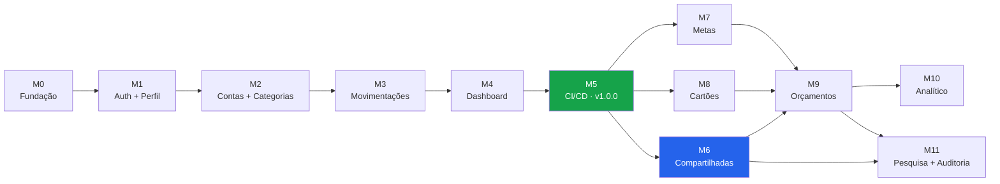

# 06 — Roadmap e Milestones

> **Documento:** Roadmap de Entregas
> **Projeto:** Gerenciador de Finanças (PFM)
> **Versão:** 1.0.0 · **Data:** 2026-07-29 · **Status:** Vigente

---

## Sumário

1. [Estrutura do roadmap](#1-estrutura-do-roadmap)
2. [Visão geral das Milestones](#2-visão-geral-das-milestones)
3. [Dependências](#3-dependências)
4. [Detalhamento das Milestones](#4-detalhamento-das-milestones)
5. [Versionamento](#5-versionamento)
6. [Riscos](#6-riscos)

---

## 1. Estrutura do roadmap

### 1.1 Como funciona

Cada **Milestone** é um incremento entregável de valor, com escopo fechado e critérios objetivos de fechamento. Cada Milestone contém um conjunto de **Issues** independentes, detalhadas em [07-ISSUES.md](07-ISSUES.md).

**Ciclo de vida de uma Milestone:**

```
Issues implementadas em branches issue/*  →  merge (squash) em staging
                    ↓
        Milestone completa em staging
                    ↓
        Verificação em homologação
                    ↓
        PR "release: Milestone N — <nome>"  staging → main
                    ↓
        Merge em main  →  pipeline de deploy automático
                    ↓
        Tag vX.Y.Z  +  Milestone fechada no GitHub
```

### 1.2 Critérios de fechamento (válidos para toda Milestone)

Além dos critérios específicos de cada uma:

- [ ] Todas as issues fechadas conforme a Definição de Pronto ([05-DEVELOPMENT.md §13](05-DEVELOPMENT.md#13-definição-de-pronto)).
- [ ] Cobertura de testes ≥ 80% no escopo entregue.
- [ ] `npm run verificar` verde nos dois pacotes.
- [ ] Documentação atualizada — em especial `04-API.md` quando o contrato muda.
- [ ] Nenhum defeito conhecido de severidade alta em aberto.
- [ ] Verificação manual dos fluxos da Milestone em 320 px, 768 px e 1440 px.
- [ ] Deploy em produção bem-sucedido, com _health check_ aprovado (da M5 em diante).

### 1.3 Estimativas

As estimativas estão em **pontos** (escala Fibonacci: 1, 2, 3, 5, 8, 13), não em dias. O ponto expressa esforço e incerteza relativos, e a velocidade real do time é medida depois das duas primeiras Milestones — antes disso qualquer conversão para calendário é chute.

| Pontos | Perfil da tarefa                                       |
| ------ | ------------------------------------------------------ |
| 1      | Trivial: configuração, ajuste isolado                  |
| 2      | CRUD simples, componente sem lógica                    |
| 3      | CRUD com validações, tela com estados                  |
| 5      | Regra de negócio não trivial, integração entre camadas |
| 8      | Funcionalidade complexa com múltiplos casos-limite     |
| 13     | Deve ser dividida antes de entrar em execução          |

---

## 2. Visão geral das Milestones

| #       | Milestone                             | Versão      |  Pontos |  Issues | Entregável                                                   |
| ------- | ------------------------------------- | ----------- | ------: | ------: | ------------------------------------------------------------ |
| **M0**  | Fundação e Infraestrutura             | —           |      34 |       9 | Repositório operante, Docker, CI, padrões aplicados          |
| **M1**  | Autenticação e Perfil                 | `0.1.0`     |      55 |      12 | Usuário se cadastra, verifica e-mail, entra e edita o perfil |
| **M2**  | Contas Financeiras e Categorias       | `0.2.0`     |      42 |      10 | Usuário cria contas e categorias e vê saldos                 |
| **M3**  | Movimentações e Transferências        | `0.3.0`     |      76 |      14 | Registro completo de receitas, despesas e transferências     |
| **M4**  | Dashboard e Relatórios                | `0.4.0`     |      50 |      10 | Visão consolidada e relatórios mensal/anual                  |
| **M5**  | CI/CD e Deploy em Produção            | **`1.0.0`** |      42 |      10 | **MVP em produção**, deploy automático com rollback          |
| **M6**  | Contas Compartilhadas                 | `1.1.0`     |      71 |      13 | Grupos financeiros com convites e permissões                 |
| **M7**  | Metas Financeiras                     | `1.1.0`     |      29 |       7 | Metas com aportes e acompanhamento                           |
| **M8**  | Cartões, Faturas e Parcelamentos      | `1.2.0`     |      63 |      12 | Ciclo completo de cartão de crédito                          |
| **M9**  | Orçamentos e Notificações             | `1.2.0`     |      52 |      11 | Orçamento por categoria com alertas                          |
| **M10** | Dashboard Analítico e Exportações     | `2.0.0`     |      47 |      10 | Análises avançadas e exportação PDF/XLSX/CSV                 |
| **M11** | Pesquisa, Auditoria e Observabilidade | `2.0.0`     |      42 |      10 | Pesquisa global, auditoria e maturidade operacional          |
|         | **Total**                             |             | **603** | **128** |                                                              |

### 2.1 Marcos de valor

| Marco                            | Milestone | Significado                                           |
| -------------------------------- | --------- | ----------------------------------------------------- |
| **Primeiro login funcional**     | M1        | Autenticação de ponta a ponta                         |
| **Primeiro registro financeiro** | M3        | O produto passa a ser útil                            |
| **MVP em produção**              | M5        | Usuários reais podem usar                             |
| **Diferencial competitivo**      | M6        | Contas compartilhadas — a razão de existir do produto |
| **Gestão financeira completa**   | M9        | Cartões, orçamentos e notificações                    |
| **Plataforma madura**            | M11       | Análise, auditoria e operação observável              |

---

## 3. Dependências



**M0 → M5 é um caminho estritamente sequencial.** Não há como paralelizar: cada Milestone consome o modelo de dados e as camadas construídas pela anterior.

**M6, M7 e M8 são paralelizáveis** após M5 — tocam entidades diferentes e não compartilham arquivos além dos utilitários. Com mais de uma pessoa no time, é aqui que a paralelização compensa.

**M9 depende das três** porque os orçamentos precisam considerar despesas de grupo (M6) e de cartão (M8), e as notificações cobrem metas (M7).

---

## 4. Detalhamento das Milestones

---

### Milestone 0 — Fundação e Infraestrutura

> **Versão:** — · **Pontos:** 34 · **Issues:** 9 · **Depende de:** —

#### Objetivo

Estabelecer a base técnica: monorepo, Docker, TypeScript estrito, lint, formatação, testes, CI e o esqueleto das duas aplicações. Nenhuma funcionalidade de negócio.

#### Escopo

- Estrutura do monorepo conforme [02-ARCHITECTURE.md §3 e §7](02-ARCHITECTURE.md#3-estrutura-de-pastas-do-backend).
- `docker-compose.yml` com PostgreSQL (dev e teste) e Mailpit.
- Backend: Express + TypeScript, validação de ambiente com Zod, envelope de resposta, hierarquia de erros, tratador global, logger Pino, `/saude`.
- Frontend: Vite + React + TS + Tailwind com tokens do Design System, roteamento base, React Query configurado, cliente Axios com interceptores.
- ESLint, Prettier, Husky, lint-staged, commitlint.
- Vitest configurado nos dois pacotes, com banco de teste.
- Workflow de CI (`ci.yml`): tipos, lint, formatação, testes, build.
- Proteção das branches `main` e `staging`.
- `README.md` raiz com instruções de setup.

#### Entregáveis

`docker compose up` sobe o ambiente; `npm run dev` inicia API e frontend; `GET /api/v1/saude` responde `200`; CI verde em PR de exemplo; commit fora do padrão é rejeitado.

#### Critérios de fechamento

- [ ] Um desenvolvedor novo consegue rodar o projeto seguindo apenas o `README.md`.
- [ ] `npm run verificar` passa nos dois pacotes.
- [ ] Commit com mensagem inválida é bloqueado pelo `commit-msg`.
- [ ] Fronteiras de camada aplicadas por ESLint (violação reprova o build).
- [ ] Tokens de cor do Design System funcionam em tema claro e escuro.

#### Riscos

Fronteiras de camada configuradas frouxamente aqui custam retrabalho em toda Milestone seguinte. Vale investir tempo em acertar `eslint-plugin-boundaries` desde já.

---

### Milestone 1 — Autenticação e Perfil

> **Versão:** `0.1.0` · **Pontos:** 55 · **Issues:** 12 · **Depende de:** M0
> **Requisitos:** RF-01 a RF-13 · **Regras:** RN-52, RN-53, RN-54

#### Objetivo

Ciclo completo de identidade: cadastro, verificação de e-mail, login, renovação de token, recuperação de senha, gestão de sessões e edição de perfil.

#### Escopo

- Migration `cria_estrutura_inicial`: `usuarios`, `perfis`, `tokens_renovacao`.
- Cadastro com bcrypt custo 12 e criação automática de perfil.
- Verificação de e-mail com token de 24 h, bloqueando acesso até a confirmação.
- Login com access token (15 min) e refresh token (7/30 dias) em cookie `httpOnly`.
- Renovação com rotação e detecção de reuso de token revogado.
- Logout individual e global; listagem e revogação de sessões.
- Recuperação e redefinição de senha; alteração de senha autenticada.
- _Rate limit_ nas rotas sensíveis (RN-54).
- Templates de e-mail (verificação, recuperação) em pt-BR.
- Frontend: telas de login, cadastro, verificação, esqueci/redefinir senha, configurações de perfil, upload de avatar, alternância de tema.
- `ContextoAutenticacao`, `RotaProtegida`, fila única de renovação no interceptor.

#### Entregáveis

Usuário se cadastra, recebe e-mail no Mailpit, verifica, entra, permanece autenticado após expiração do access token, edita o perfil, troca o tema e sai.

#### Critérios de fechamento

- [ ] Fluxo completo cadastro → verificação → login → uso → logout funciona ponta a ponta.
- [ ] Access token expirado é renovado transparentemente, sem que o usuário perceba.
- [ ] Requisições concorrentes com token expirado disparam **uma** renovação.
- [ ] Reuso de refresh token revogado invalida toda a família de tokens.
- [ ] Login em conta não verificada responde `403 EMAIL_NAO_VERIFICADO`.
- [ ] 5 tentativas falhas em 15 min bloqueiam temporariamente (RN-54).
- [ ] Senha nunca aparece em log, resposta ou _stack trace_.
- [ ] Cobertura ≥ 85% em `autenticacao.servico.ts`.

#### Riscos

O fluxo de refresh token é a fonte mais comum de bugs sutis (loop de renovação, sessão caindo aleatoriamente). Merece teste de integração para reuso, concorrência e rotação.

---

### Milestone 2 — Contas Financeiras e Categorias

> **Versão:** `0.2.0` · **Pontos:** 42 · **Issues:** 10 · **Depende de:** M1
> **Requisitos:** RF-14 a RF-22 · **Regras:** RN-01 a RN-08

#### Objetivo

Estruturas que dão sentido a uma movimentação: contas com saldo e categorias com hierarquia. Aqui nasce o motor de cálculo de saldo.

#### Escopo

- Migration `adiciona_contas_e_categorias`.
- CRUD de contas com arquivamento, reordenação e proteção contra exclusão com histórico.
- Cálculo de saldo atual e previsto (RN-01 a RN-05) — `utilitarios/dinheiro.ts` com `Decimal`.
- Saldo consolidado respeitando `incluirNoSaldoTotal`.
- Categorias padrão do sistema (seed) copiadas no cadastro do usuário.
- CRUD de categorias com subcategorias de um nível e recategorização na exclusão.
- CRUD de etiquetas.
- Frontend: página de contas com cartões de saldo, formulários, página de categorias com árvore, seletores reutilizáveis (`SelecionadorConta`, `SelecionadorCategoria`).

#### Entregáveis

Usuário cria contas de tipos variados, vê o saldo consolidado, cria categorias e subcategorias próprias e arquiva conta sem perder histórico.

#### Critérios de fechamento

- [ ] Saldo consolidado ignora contas arquivadas e as marcadas como fora do total.
- [ ] `utilitarios/dinheiro.ts` com 100% de cobertura, incluindo casos de arredondamento.
- [ ] Exclusão de conta com movimentações responde `409` sugerindo arquivamento.
- [ ] Exclusão de categoria em uso exige `recategorizarPara`.
- [ ] Subcategoria de subcategoria é rejeitada com `422`.
- [ ] Nome duplicado no mesmo escopo responde `409` (índice único parcial ativo).
- [ ] Nenhuma operação monetária usa `number`.

---

### Milestone 3 — Movimentações e Transferências

> **Versão:** `0.3.0` · **Pontos:** 76 · **Issues:** 14 · **Depende de:** M2
> **Requisitos:** RF-23 a RF-39 · **Regras:** RN-09 a RN-27

#### Objetivo

A Milestone mais densa e mais importante. Entrega o núcleo do produto: registrar dinheiro entrando e saindo, com recorrência, situações de pagamento, anexos, etiquetas e transferências atômicas.

#### Escopo

- Migrations `adiciona_movimentacoes_e_etiquetas` e `constraints_dominio` (todos os `CHECK` e índices de [03-DATABASE.md §6](03-DATABASE.md#6-constraints-não-expressáveis-no-prisma)).
- CRUD de movimentações com validação completa de escopo e compatibilidade de categoria.
- Situações de pagamento: pagar total/parcial, estornar, marcação automática de atraso.
- Recorrências materializadas com registro-mãe e geração de 12 meses (ADR-006).
- Edição e exclusão com escopo (`APENAS_ESTA` / `ESTA_E_FUTURAS` / `TODAS`).
- Duplicação de movimentação.
- Transferências como par vinculado, criadas e excluídas atomicamente (ADR-007).
- Anexos com validação por _magic number_ e entrega por rota autenticada.
- Aplicação de etiquetas.
- Listagem com todos os filtros, paginação, ordenação e totalizadores.
- Tarefas agendadas: `marcar-atrasadas`, `gerar-recorrencias`.
- Frontend: página de movimentações com filtros persistidos na URL, formulário completo, ações rápidas, formulário de transferência, upload de anexos, tabela responsiva que vira cartões em mobile.

#### Entregáveis

Usuário registra receitas e despesas, define recorrência, paga parcialmente, anexa comprovante, filtra por qualquer combinação de critérios e transfere entre contas com os dois extratos corretos.

#### Critérios de fechamento

- [ ] Todas as constraints de [03-DATABASE.md §6](03-DATABASE.md#6-constraints-não-expressáveis-no-prisma) aplicadas e testadas por violação deliberada.
- [ ] Saldo permanece correto após criar, editar, pagar, estornar e excluir.
- [ ] Pagamento parcial afeta o saldo apenas por `valorPago` (RN-03).
- [ ] Transferência cria dois lançamentos e é excluída atomicamente (RN-26, RN-39).
- [ ] Transferência não entra em totalizadores de receita/despesa (RN-25).
- [ ] Edição de ocorrência sem `escopoEdicao` responde `400`.
- [ ] Modelo de recorrência nunca aparece em listagens nem em saldos.
- [ ] Anexo com extensão falsificada é rejeitado (`415`).
- [ ] Filtros combinados produzem os mesmos totalizadores que a soma manual.
- [ ] `EXPLAIN ANALYZE` da listagem filtrada não apresenta `Seq Scan`.
- [ ] Cobertura ≥ 90% em `movimentacao.servico.ts` e `transferencia.servico.ts`.

#### Riscos

Escopo grande e alta densidade de regras. **Não** iniciar M4 antes do fechamento completo: erro de saldo aqui contamina todo o dashboard e os relatórios. Se houver pressão de prazo, corte anexos e etiquetas (RF-32, RF-33) para uma Milestone posterior, nunca as regras de saldo.

---

### Milestone 4 — Dashboard e Relatórios

> **Versão:** `0.4.0` · **Pontos:** 50 · **Issues:** 10 · **Depende de:** M3
> **Requisitos:** RF-40 a RF-43, RF-47, RF-72 a RF-74

#### Objetivo

Transformar dados em informação. Dashboard consolidado e relatórios mensal, anual, por categoria, por conta e de fluxo de caixa.

#### Escopo

- Migration `adiciona_views_saldo` (view `vw_saldo_conta`).
- Endpoint `/dashboard` agregado, mais os granulares.
- Indicadores com variação percentual contra o período anterior e taxa de poupança.
- Fluxo de caixa de 12 meses com `generate_series` (sem lacunas).
- Agregação por categoria com percentuais.
- Relatórios mensal, anual, por categoria, por conta e fluxo de caixa.
- Frontend: dashboard responsivo com cartões de indicador, gráficos Recharts (linha, pizza, barra), seletor de período, últimas movimentações; página de relatórios com abas.
- Acessibilidade dos gráficos: tabela equivalente ou resumo textual (A11Y-04).

#### Entregáveis

Tela inicial que responde em uma olhada "quanto tenho, quanto entrou, quanto saiu, para onde foi" e relatórios navegáveis por período.

#### Critérios de fechamento

- [ ] `/dashboard` responde em < 300 ms com base de ~5 000 movimentações.
- [ ] Fluxo de caixa traz 12 pontos, inclusive meses sem movimentação.
- [ ] Somatórios do dashboard conferem com os da listagem de movimentações para o mesmo filtro.
- [ ] Transferências excluídas de todos os indicadores e relatórios (RN-25).
- [ ] Gráficos legíveis em 320 px e acessíveis por teclado e leitor de tela.
- [ ] Cores dos gráficos com contraste adequado nos dois temas.
- [ ] Relatório mensal confere com o extrato do período, valor a valor.

---

### Milestone 5 — CI/CD e Deploy em Produção

> **Versão:** **`1.0.0`** · **Pontos:** 42 · **Issues:** 10 · **Depende de:** M4
> **Requisitos:** RNF-07 a RNF-12, RNF-19 a RNF-22

#### Objetivo

**Publicar o MVP.** Automatizar build, testes, imagem, deploy na VPS Hostinger, verificação de saúde e rollback.

#### Escopo

- `Dockerfile` multi-estágio do backend com `pm2-runtime` em modo cluster (ADR-008).
- `docker-compose.prod.yml` com API e PostgreSQL.
- Provisionamento da VPS: usuário de deploy, Docker, Nginx, firewall, chaves SSH.
- Nginx: TLS, proxy reverso, SPA estática, compressão, cabeçalhos de segurança, HSTS.
- Certificado Let's Encrypt com renovação automática.
- Workflow `deploy-producao.yml`: build → testes → imagem → push via SSH → migrations → _reload_ → _health check_ → rollback em falha.
- `GET /saude/prontidao` verificando banco, migrations e armazenamento.
- Backup diário do PostgreSQL com retenção e dump pré-migration.
- Logs estruturados com `requestId` e encerramento gracioso.
- Workflow de deploy em `staging` (homologação).

#### Entregáveis

Merge em `main` publica em produção sem intervenção manual; falha no _health check_ reverte automaticamente para a versão anterior.

#### Critérios de fechamento

- [ ] Merge em `main` publica sem passo manual.
- [ ] Deploy sem _downtime_ perceptível (verificado com requisições contínuas durante a publicação).
- [ ] Falha deliberada no _health check_ dispara rollback e a versão anterior volta a atender.
- [ ] HTTPS com nota A em SSL Labs; HTTP redireciona para HTTPS.
- [ ] Certificado renova automaticamente (simulação com `certbot renew --dry-run`).
- [ ] Backup diário executando; restauração testada em banco descartável.
- [ ] Nenhum segredo no repositório — tudo em GitHub Secrets.
- [ ] PostgreSQL inacessível pela internet.
- [ ] Logs de produção em JSON, sem senha, token ou dado pessoal.
- [ ] Tarefas agendadas rodam em uma única instância do cluster.

#### Riscos

Primeiro contato com a VPS. Reserve tempo para DNS, propagação e emissão de certificado. **Ensaie o rollback** antes de precisar dele — rollback não testado é rollback que falha.

---

### Milestone 6 — Contas Compartilhadas

> **Versão:** `1.1.0` · **Pontos:** 71 · **Issues:** 13 · **Depende de:** M5
> **Requisitos:** RF-37, RF-44, RF-53 a RF-60 · **Regras:** RN-28 a RN-39

#### Objetivo

Entregar o diferencial do produto: grupos financeiros com membros, papéis, convites e histórico auditável.

#### Escopo

- Migration `adiciona_contas_compartilhadas`: grupos, membros, convites, colunas de escopo nas entidades duais e recriação dos `CHECK` na forma completa.
- CRUD de grupos com imagem e configuração de permissão do participante.
- Middleware `autorizarCompartilhada` aplicando a matriz RN-30.
- Gestão de membros: alterar papel, remover, sair, transferir administração (atômica).
- Convites: enviar, listar, cancelar, aceitar, recusar, expirar; pré-visualização pública com e-mail mascarado.
- Contas, categorias, movimentações e etiquetas no escopo de grupo.
- Transferência entre conta pessoal e conta de grupo (RF-37).
- Objeto `minhasPermissoes` resolvido pelo servidor.
- Tarefa `limpar-tokens` estendida para expirar convites.
- Frontend: lista de grupos, detalhe com abas (movimentações, membros, categorias, configurações), fluxo de convite, indicador de autor nos lançamentos, controles condicionados ao papel.

#### Entregáveis

Usuário cria o grupo "Casa", convida a pessoa com quem divide as despesas, ela aceita e ambos lançam despesas no caixa comum, cada um vendo quem registrou o quê.

#### Critérios de fechamento

- [ ] Matriz de permissões RN-30 aplicada e testada para **cada** combinação papel × ação.
- [ ] Todo grupo tem sempre exatamente um administrador (índice único parcial + teste).
- [ ] Administrador não consegue sair nem ser removido sem transferir a administração.
- [ ] Transferência de administração é atômica: nunca há dois nem zero administradores.
- [ ] Participante não edita lançamento de terceiro; com `permiteParticipanteEditarProprias = false`, não edita nem os próprios.
- [ ] Observador não cria nem altera nada.
- [ ] Não membro recebe `404` (não `403`) ao acessar o grupo.
- [ ] Convite expirado não pode ser aceito; convite duplicado responde `409`.
- [ ] Convite para e-mail sem cadastro funciona após o cadastro (RN-37).
- [ ] Movimentações de ex-membro permanecem no grupo (RN-34).
- [ ] Pré-visualização pública de convite não expõe dado financeiro.
- [ ] Cobertura ≥ 90% em `conta-compartilhada.servico.ts` e `convite.servico.ts`.

#### Riscos

Milestone com a maior superfície de segurança do projeto. Cada rota de grupo precisa de teste de autorização negativa — não basta testar que o administrador consegue; é preciso testar que o participante e o observador **não** conseguem.

---

### Milestone 7 — Metas Financeiras

> **Versão:** `1.1.0` · **Pontos:** 29 · **Issues:** 7 · **Depende de:** M5 (paralela a M6)
> **Requisitos:** RF-45, RF-61 a RF-64 · **Regras:** RN-46, RN-47

#### Objetivo

Permitir que o usuário defina objetivos e acompanhe o progresso.

#### Escopo

- Migration `adiciona_metas`: `metas`, `movimentacoes_meta`.
- CRUD de metas com prazo, cor e ícone; escopo pessoal ou de grupo.
- Aportes e resgates, com ou sem movimentação vinculada.
- Cálculo de progresso e aporte mensal necessário.
- Conclusão automática ao atingir o alvo, com notificação.
- Frontend: página de metas com barra de progresso, formulário de aporte, cartão de meta no dashboard.

#### Critérios de fechamento

- [ ] Aporte com `gerarMovimentacao: true` debita a conta e cria a movimentação vinculada (RN-47).
- [ ] Exclusão de aporte recalcula `valorAcumulado` e remove a movimentação, na mesma transação.
- [ ] Resgate que deixaria `valorAcumulado` negativo é rejeitado com `422`.
- [ ] Meta atinge 100% → situação `CONCLUIDA`, `concluidaEm` preenchido, notificação criada.
- [ ] `aporteMensalNecessario` é `null` quando não há prazo.
- [ ] Progresso exibido limitado a 100%, mesmo com acumulado acima do alvo.

---

### Milestone 8 — Cartões, Faturas e Parcelamentos

> **Versão:** `1.2.0` · **Pontos:** 63 · **Issues:** 12 · **Depende de:** M5 (paralela a M6/M7)
> **Requisitos:** RF-28, RF-48 a RF-52 · **Regras:** RN-21, RN-40 a RN-45

#### Objetivo

Ciclo completo de cartão de crédito: alocação automática em fatura, cálculo de limite, parcelamentos exatos e pagamento de fatura.

#### Escopo

- Migration `adiciona_cartoes_faturas_parcelamentos`.
- CRUD de cartões com limite, fechamento e vencimento.
- Utilitário de ciclo de fatura: determina a fatura de uma compra a partir da data e do dia de fechamento (RN-40), com tratamento de meses curtos (RN-41).
- Criação automática de faturas por ciclo; alocação da despesa na criação.
- Cálculo de limite utilizado e disponível (RN-42), com aviso — não bloqueio — ao exceder (RN-43).
- Parcelamento com rateio exato e resto na última parcela (RN-21).
- Pagamento total e parcial de fatura, gerando despesa na conta pagadora sem duplicar itens (RN-45).
- Tarefa `fechar-faturas` e notificações de fatura fechada e a vencer.
- Frontend: página de cartões com anel de limite, detalhe de fatura com resumo por categoria, formulário de compra parcelada com pré-visualização das parcelas, fluxo de pagamento.

#### Critérios de fechamento

- [ ] Compra **no dia exato** do fechamento entra na fatura do ciclo seguinte (RN-40) — teste explícito.
- [ ] `diaFechamento = 31` funciona em fevereiro, abril e em ano bissexto (RN-41).
- [ ] `Σ parcelas = valorTotal` exatamente, verificado para `1000/3`, `100/7`, `0.05/2`, `10/4` (RN-21).
- [ ] Limite disponível considera apenas faturas abertas, fechadas e parcialmente pagas.
- [ ] Lançamento acima do limite gera aviso e é aceito (RN-43).
- [ ] Pagamento de fatura debita a conta uma única vez, sem duplicar as despesas do cartão (RN-45).
- [ ] Pagamento parcial resulta em `PAGA_PARCIALMENTE` e `valorRestante` correto.
- [ ] Tarefa de fechamento é idempotente — reexecução no mesmo dia não altera nada.
- [ ] Cobertura 100% em `utilitarios/data.ts` (ciclos de fatura).

#### Riscos

Aritmética de datas e arredondamento são as duas áreas com maior taxa histórica de defeito em software financeiro. Escreva os testes de caso-limite **antes** da implementação.

---

### Milestone 9 — Orçamentos e Notificações

> **Versão:** `1.2.0` · **Pontos:** 52 · **Issues:** 11 · **Depende de:** M6, M7, M8
> **Requisitos:** RF-46, RF-65 a RF-71 · **Regras:** RN-48 a RN-50

#### Objetivo

Fechar o ciclo de controle: planejar limites de gasto, medir o consumo e avisar antes de estourar.

#### Escopo

- Migration `adiciona_orcamentos_e_notificacoes`.
- CRUD de orçamentos por categoria, escopo e período, com unicidade garantida.
- Cálculo de consumo, percentual, projeção de fim de mês e situação de alerta.
- Replicação de orçamentos entre meses.
- Sistema de notificações in-app com todos os tipos de `TipoNotificacao`.
- Marcação de lida individual e em massa; contagem de não lidas.
- Alertas idempotentes por limiar de 80/90/100% (RN-50).
- Tarefas `alertar-orcamentos` e `notificar-vencimentos`.
- Preferências de notificação no perfil.
- Frontend: página de orçamentos com barras e semáforo, central de notificações com _badge_, alertas no dashboard.

#### Critérios de fechamento

- [ ] Consumo considera apenas despesas do período pela `dataCompetencia`, excluindo transferências e canceladas (RN-49).
- [ ] Consumo de orçamento de grupo considera despesas do grupo; de orçamento pessoal, apenas as pessoais.
- [ ] Cada limiar dispara **no máximo uma** notificação por orçamento por período (RN-50) — verificado reexecutando a tarefa.
- [ ] Orçamento duplicado para o mesmo período responde `409`.
- [ ] Replicação com `sobrescrever: false` preserva os existentes e reporta os ignorados.
- [ ] `situacaoAlerta` e `projecaoFimMes` corretos nas quatro faixas.
- [ ] Notificação desativada no perfil não é criada.
- [ ] Tarefas agendadas idempotentes, com log de registros afetados.

---

### Milestone 10 — Dashboard Analítico e Exportações

> **Versão:** `2.0.0` · **Pontos:** 47 · **Issues:** 10 · **Depende de:** M9
> **Requisitos:** RF-75 a RF-79

#### Objetivo

Análise avançada e portabilidade dos dados.

#### Escopo

- Relatório comparativo entre dois períodos arbitrários.
- Indicadores derivados: média de gastos, maior despesa, taxa de poupança, evolução patrimonial.
- Gráficos adicionais: área, _heatmap_ de gastos por dia da semana, barras empilhadas por categoria.
- Comparativo de 12 meses por categoria, conta e usuário (em grupos).
- Exportação em PDF (com gráficos), XLSX e CSV.
- Processamento assíncrono para relatórios grandes, com entrega por e-mail.
- Frontend: página de análises com filtros combináveis, modal de exportação, indicador de progresso.

#### Critérios de fechamento

- [ ] Comparativo aceita períodos de durações diferentes e sinaliza a diferença ao usuário.
- [ ] Exportação CSV abre corretamente no Excel em pt-BR (separador e _encoding_ UTF-8 com BOM).
- [ ] PDF legível em A4, com gráficos e cabeçalho identificando período e escopo.
- [ ] XLSX com valores como número (não texto), permitindo soma na planilha.
- [ ] Relatório com mais de 5 000 linhas responde `202` e chega por e-mail.
- [ ] _Heatmap_ acessível: acompanhado de tabela equivalente (A11Y-04).
- [ ] Nenhuma exportação vaza dado fora do escopo do solicitante.

---

### Milestone 11 — Pesquisa, Auditoria e Observabilidade

> **Versão:** `2.0.0` · **Pontos:** 42 · **Issues:** 10 · **Depende de:** M6, M9
> **Requisitos:** RF-09, RF-80 a RF-83, RNF-19 a RNF-22

#### Objetivo

Maturidade operacional: encontrar qualquer coisa, saber quem fez o quê e observar o sistema em produção.

#### Escopo

- Migration `adiciona_indice_trgm_e_auditoria` com `pg_trgm`.
- Pesquisa global multi-entidade respeitando o escopo de acesso.
- Log de auditoria em todas as ações sensíveis, com estado anterior e novo.
- Consulta de auditoria pelo administrador do grupo.
- Exclusão de conta com anonimização (RF-09) e exportação de dados (LGPD).
- Métricas de requisição expostas para coleta.
- Painel operacional simples: contagem de erros, latência p95, tarefas executadas.
- Frontend: pesquisa global com atalho de teclado (`Ctrl/Cmd + K`), debounce e navegação por teclado; aba de auditoria no grupo.

#### Critérios de fechamento

- [ ] Pesquisa retorna apenas recursos do escopo do solicitante (RF-81) — teste com dois usuários.
- [ ] Bloco `usuarios` traz somente membros de grupos em comum.
- [ ] Pesquisa por texto usa o índice trigram (`EXPLAIN` confirma), sem `Seq Scan`.
- [ ] Toda ação sensível gera log com autor, entidade, estado anterior, IP e `requestId`.
- [ ] Log de auditoria é imutável — não há endpoint de edição ou exclusão.
- [ ] Auditoria de grupo acessível apenas ao administrador.
- [ ] Exclusão de conta anonimiza dados pessoais e preserva registros de grupo (RN-34).
- [ ] Exportação de dados entrega tudo o que o usuário forneceu, em formato legível.
- [ ] Atalho `Ctrl/Cmd + K` funciona em qualquer tela, com foco e navegação por teclado.

---

## 5. Versionamento

### 5.1 Semântica

`MAJOR.MINOR.PATCH` — [SemVer](https://semver.org/lang/pt-BR/).

| Componente | Incrementa quando                                        |
| ---------- | -------------------------------------------------------- |
| `MAJOR`    | Mudança incompatível no contrato de API                  |
| `MINOR`    | Funcionalidade nova compatível (fechamento de Milestone) |
| `PATCH`    | Correção compatível (hotfix)                             |

### 5.2 Mapa de versões

| Versão      | Milestone | Conteúdo                                     |
| ----------- | --------- | -------------------------------------------- |
| `0.1.0`     | M1        | Autenticação e perfil                        |
| `0.2.0`     | M2        | Contas e categorias                          |
| `0.3.0`     | M3        | Movimentações e transferências               |
| `0.4.0`     | M4        | Dashboard e relatórios                       |
| **`1.0.0`** | M5        | **MVP em produção**                          |
| `1.1.0`     | M6, M7    | Contas compartilhadas e metas                |
| `1.2.0`     | M8, M9    | Cartões, orçamentos e notificações           |
| **`2.0.0`** | M10, M11  | Analítico, exportações, pesquisa e auditoria |

`2.0.0` incrementa o _major_ por consolidar o conjunto de recursos e permitir ajustes de contrato acumulados. Se nenhuma mudança incompatível ocorrer até lá, a versão será `1.3.0` — a decisão é tomada no fechamento de M10.

### 5.3 CHANGELOG

`CHANGELOG.md` na raiz, formato [Keep a Changelog](https://keepachangelog.com/pt-BR/), atualizado no PR de release com seções `Adicionado`, `Alterado`, `Corrigido`, `Removido`, `Segurança`.

---

## 6. Riscos

| #   | Risco                                                         | Impacto  |  Prob.   | Mitigação                                                                                                                           |
| --- | ------------------------------------------------------------- | :------: | :------: | ----------------------------------------------------------------------------------------------------------------------------------- |
| R1  | Erro no cálculo de saldo passa para M4+                       | **Alto** |  Média   | Cobertura ≥ 90% em serviços; 100% em `dinheiro.ts`; testes de invariante (soma de parcelas, saldo após ciclo completo de operações) |
| R2  | Falha de autorização em contas compartilhadas                 | **Alto** |  Média   | Teste negativo obrigatório para cada combinação papel × ação; `minhasPermissoes` resolvido no servidor                              |
| R3  | Deploy quebra produção sem rollback funcional                 | **Alto** |  Baixa   | _Health check_ como portão; rollback ensaiado em M5; backup pré-migration                                                           |
| R4  | Aritmética de datas em faturas (meses curtos, bissexto, DST)  |  Médio   | **Alta** | 100% de cobertura em `data.ts`; casos-limite escritos antes da implementação                                                        |
| R5  | Degradação de desempenho com o crescimento de `movimentacoes` |  Médio   |  Média   | Índices parciais desde M3; `EXPLAIN ANALYZE` obrigatório em PR que toca consulta                                                    |
| R6  | Cache desatualizado exibindo saldo incorreto                  |  Médio   | **Alta** | Invalidação em cascata documentada; item obrigatório no checklist de PR                                                             |
| R7  | M3 estourar o escopo e atrasar a cadeia até M5                |  Médio   |  Média   | Anexos e etiquetas são o corte previsto; regras de saldo nunca são cortadas                                                         |
| R8  | Migration destrutiva com perda de dados                       | **Alto** |  Baixa   | Plano de duas fases obrigatório; dump automático pré-migration; SQL lido na revisão                                                 |
| R9  | Vazamento de segredo no repositório                           | **Alto** |  Baixa   | Tudo em GitHub Secrets; `.env` no `.gitignore`; varredura de segredos no CI                                                         |
| R10 | Documentação divergir do código                               |  Médio   | **Alta** | `04-API.md` no checklist de PR; contrato verificado em teste de integração                                                          |

---

**Documentos relacionados:** [01-SPECIFICATION.md](01-SPECIFICATION.md) · [07-ISSUES.md](07-ISSUES.md) · [05-DEVELOPMENT.md](05-DEVELOPMENT.md) · [08-CICD.md](08-CICD.md)
